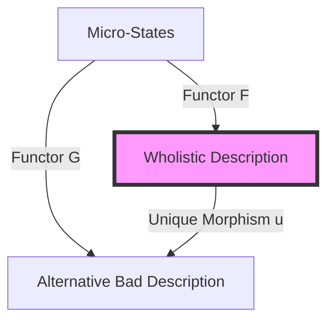

# Appendix A: Category Theory and the Reality of Wholes

## 0. What This Appendix Proves

> **Summary of Claims**
>
> This appendix establishes three formal claims:
>
> 1.  The lattice of coarse-grainings described in the main text forms a well-defined category, **$\mathcal{C}_{pred}$** (Category of Predictive Models).
> 2.  Causally closed wholes correspond to objects satisfying a **universal property** (Initial Objects) in the subcategory of faithful models.
> 3.  Reductionist descriptions fail because the relevant functors from macro to micro are **not faithful**; they fail to preserve the causal structure of counterfactuals.
>
> The appendix is not illustrative or metaphorical. Its purpose is to show that the paper’s criterion of reality (Causal Closure / low leakiness) corresponds to a precise categorical property.

## 1. Why Category Theory?

Throughout "The Reality of Wholes," we argue that certain boundaries (such as $\pi$, oxygen's molecular structure, the hurricane's vortex) are not arbitrary choices but constraint-determined inevitabilities. Any agent working under the same constraints will converge on the same compression targets. But what makes these boundaries *inevitable* rather than merely *useful*?

Category theory provides the formal language to answer this. While set theory asks "what exists?" (membership), category theory asks "what transforms into what?" (morphisms). This shift is crucial because our argument is **structural realist**: reality consists not of fundamental "stuff" but of invariant dependency structures.

### 1.1 What Category Theory Adds
Computational mechanics (the $\epsilon$-machine framework used in the main text) provides the **metric** for closure: it tells us *when* a boundary is non-leaky. Category theory provides the **ontology**: it explains *why* such closure implies existence.

Specifically, category theory allows us to:
1.  **Distinguish Constitution from Covariance**: Separating the constraints that define the space from the laws that transform within it.
2.  **Formalize Inevitability**: Replacing vague terms like "robust" with precise definitions like "Initial Object."
3.  **Prove Non-Reducibility**: Showing that reductionism is a "forgetful functor" that loses essential structural information.

## 2. The Category of Coarse-Grainings

Section 6.1 of the paper describes a "lattice of real patterns." We can now formalize this structure.

> **Definition (Category of Predictive Models $\mathcal{C}_{pred}$)**
>
> Let $\mathcal{C}_{pred}$ be the category where:
>
> *   **Objects**: Predictive state spaces $(Z, T)$, where $Z$ is a set of states and $T$ is a transition operator satisfying the Markov property.
> *   **Morphisms**: Deterministic maps $g: Z_1 \to Z_2$ that preserve predictive sufficiency. That is, if you can predict the future in $Z_1$, mapping to $Z_2$ and predicting there yields a consistent result (the diagram commutes).
> *   **Composition**: Standard function composition ($g \circ f$).
> *   **Identity**: The identity map ($id_Z: Z \to Z$).

This creates a rigorous playground. A "coarse-graining" is no longer a hand-wavy idea; it is a valid morphism in this category. Crucially, not all arbitrary groupings of variables qualify as objects. If a grouping fails to satisfy the Markov property (i.e., it is leaky), it is not an object in $\mathcal{C}_{pred}$.

## 3. Causal Closure as Functorial Equivalence

The paper’s central criterion for reality is **Causal Closure**: the condition where the $\epsilon$-machine (internal predictor) equals the $\nu$-machine (optimal predictor including external data). We can now translate this into categorical terms.

Let $F: \mathcal{C}_{micro} \to \mathcal{C}_{macro}$ be the coarse-graining functor that maps micro-states to macro-states.

**Theorem:** Causal Closure holds if and only if $F$ is **Faithful** on the subcategory of predictive morphisms.

> **Definition (Faithfulness)**
> A functor is faithful if it is injective on morphisms (hom-sets).
> $$ F(f) = F(g) \implies f = g $$

In plain English: Faithfulness means that **no distinct causal distinctions at the micro-level are lost at the macro-level**. If two micro-causal paths lead to different outcomes, their macro-images must also be distinct. If the coarse-graining "smears" distinct causal pathways into a single confused blob, the functor is not faithful, and Causal Closure fails.

This is the formal definition of "reality" in our framework: **Real entities are those preserved by faithful functors.**

## 4. Wholes as Universal Objects

Why do different investigators converge on the same boundaries (e.g., the hurricane)? Because real wholes satisfy a **Universal Property**.

In category theory, a universal property characterizes an object entirely by its relationships to other objects, usually as an "Initial" or "Terminal" object.

**Claim:** A "Whole" is an **Initial Object** in the subcategory of causally closed models ordered by algorithmic complexity.

> **Universal Property of the Whole**
>
> Let $\mathbf{W}$ be the Whole (the macro-description). For any other causally closed predictive model $\mathbf{X}$, there exists a **unique morphism** $u: \mathbf{W} \to \mathbf{X}$.

This means $\mathbf{W}$ is the "base" reality for that domain. Any other valid description $\mathbf{X}$ is either a copy of $\mathbf{W}$ or an unnecessary elaboration (adding useless epicycles). You cannot create a *simpler* model that maintains causal closure (you'd lose the initial property), and you cannot create a *different* model without breaking closure or increasing complexity unnecessarily.

### 4.1 Commutative Diagram
The inevitability can be visualized:

The diagram shows that any alternative description $A$ factors through $W$. The Whole ($W$) is the necessary passage point for clear causal reasoning.

## 5. Why Reductionist Functors Fail

The reductionist claim is that the micro-description is always "better" or "more real." Category theory refutes this by analyzing the properties of the **Reduction Functor** $R: \mathcal{C}_{macro} \to \mathcal{C}_{micro}$ (the attempt to map macro-objects back to specific micro-configurations).

**Failure of Fullness:** The reduction functor is not **Full**.
A functor is Full if it captures all morphisms between objects. But macro-systems exhibit counterfactual dependencies ("If the price had dropped, I would have bought") that technically do not exist at the micro-level (where specific particle trajectories are fixed). The reductionist description cannot express these modal facts without importing the entire universe of data, violating the thermodynamic constraint.

**Failure of Faithfulness:** The reduction functor is often not Faithful in the reverse direction. It maps distinct macro-causal types to identical micro-physics laws, losing the *structure* of the macro-interaction.

### 5.1 A Note on Noether's Theorem
This mirrors the logic of Noether's Theorem. We rely on Noether not to derive conservation laws, but as an existence proof of a **constraint-first ontology**. In physics, symmetries (constraints) generate conservation laws (dynamics). Similarly, in our framework, constraints (e.g., information bounds) generate the available causal morphisms.

## 6. Constraints and Invariance

To prevent confusion, we must distinguish three distinct "layers" of invariance often collapsed in standard accounts.

### 6.1 The Three Kinds of Invariance

1.  **Constitutive Invariance (Constraints)**
    *   **What**: The structural conditions that define the category itself.
    *   **Examples**: Locality (speed of light limit), Thermodynamics (Landauer's limit).
    *   **Status**: These determine *which morphisms are admissible*. They cannot vary within the domain.
    *   *Note: Constraints are not just "missing arrows"; they are the conditions of admissibility.*

2.  **Covariant Invariance (Rules)**
    *   **What**: The laws of motion or transition rules.
    *   **Examples**: Newton's laws, Maxwell's equations.
    *   **Status**: These describe *how valid morphisms transform*. They vary by coordinate system but preserve structure (covariance).

3.  **Convergent Invariance (Wholes)**
    *   **What**: The stable objects that agents agree upon.
    *   **Examples**: Hurricanes, Cells, Tables.
    *   **Status**: These are the *Initial Objects* selected by the constraints.

### 6.2 Constraints vs Rules: Two Generative Mechanisms
This distinction reveals two different ways structure emerges:
*   **Generation by Elimination (Constraints)**: We start with a space of all possibilities and *carve away* the impossible (non-local, infinite-energy). What remains is the "shape" of the category.
*   **Generation by Composition (Rules)**: Inside that shape, we compose small arrows to make long paths (dynamics).

The $\epsilon$-machine is the minimal closed diagram that survives the elimination process.

## 7. Illustrative Extensions (Non-Formal)

The formal proof applies to physical systems, but the categorical logic extends to other domains where compositionality holds.

### 7.1 Mathematical Objects (e.g., $\pi$)
$\pi$ is not a physical object, yet it is undisputed reality. Why? Because it is a **Terminal Object** in the category of geometric ratios. You can try to use $\pi' = 3.15$, but you will fail to satisfy the commutative diagrams of geometry; your circles won't close. $\pi$ is the unique value forced by the constraints of Euclidean space.

### 7.2 Social Entities (e.g., Corporations)
A corporation is a "Whole" in the **Category of Legal Contracts**. It satisfies causal closure there: the "Lawsuit" morphism operates on the "Corporation" object, predicting a "Fine" or "Bankruptcy" outcome. The physical location of the CEO is irrelevant to this morphism. The corporation is real because it is a closed node in the legal category.

### 7.3 The Dragon Stress-Test
This brings us to the "Dragon" example. Is a dragon real?
*   **Physical Category**: No. There is no faithful functor from micro-biology to "fire-breathing reptile."
*   **Narrative Category**: **Conditional Yes.** *If* we formalize the category of Narrative Dynamics (where objects are archetypes and morphisms are plot functions), and *if* "Dragon" functions as a predictively closed node (predicting "Hero's Challenge"), then the Dragon is an object in that category.
    *   *Note: This is an empirical claim about story compression, not a metaphysical claim about lizards.*

## 8. Conclusion: Necessity, Not Mystique

By translating the paper’s argument into category theory, we replace poetic intuition with structural necessity.

Reality is not "stuff." Reality consists in **structures that satisfy universal predictive constraints under admissible morphisms**.

*   The **Category** defines the game boundaries (Constraints).
*   The **Functor** defines the validity of the description (Faithfulness).
*   The **Initial Object** defines the inevitable focal points (Wholes).

If reality is defined as that which any capable agent must encode to predict and intervene under shared constraints, then entities achieving morphism-closure are real. Category theory explains why such entities are invariant without being fundamental.
