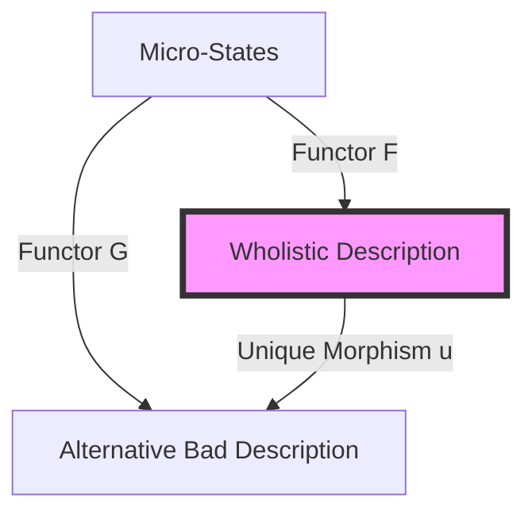

# When Prediction Replaces Parts: A Criterion for What's Real - A Case Against Mereological Nihilism

## Abstract

Mereological nihilism posits that macroscopic objects possess no ontological standing, claiming only fundamental particles are real. This paper challenges that view by integrating computational mechanics with the interventionist theory of causation. We argue that once we accept four uncontroversial premises (causality, locality, information, and thermodynamics), statistical boundaries emerge as robustly selected features of physical systems, not optional human conventions.

These boundaries create causal autonomy, which we formalize using the $\varepsilon$-machine/$\upsilon$-machine framework from computational mechanics (Shalizi and Crutchfield 2001; Rosas et al. 2024). A macro-variable achieves Causal Closure when its $\varepsilon$-machine (predicting macro-futures from macro-pasts) equals its $\upsilon$-machine (predicting macro-futures from micro-pasts). At this point, additional micro-information is provably redundant...

We defend this view against retreats to "mere usefulness," address challenges from consciousness, and demonstrate practical implications across medicine, ecology, and technology. Where causal powers, counterfactual stability, and resistance to informational intrusion converge, objecthood is established. Wholes are not fundamental, but they are metaphysically real as "Real Patterns" (Dennett 1991) and unified loci of causal powers. Any sufficiently capable agent will converge on these patterns, since ignoring them incurs unsustainable complexity. The hurricane is as real as its molecules in this sense.

### Introduction

A hurricane destroys a house. A mereological nihilist stands in the wreckage and claims the hurricane never existed; only particles arranged hurricane-wise did the damage. This paper argues that this distinction is not merely pedantic; it is incompatible with the explanatory constraints of successful science. Mereological nihilism claims there are no hurricanes, only molecules arranged hurricane-wise; no cells, only particles arranged cell-wise.

### Clarifying 'Real': Four Layered Criteria

Disputes about whether wholes are "real" often trade on four layered criteria: Invariance, Physicality, Substrate Proximity (Fundamentality), and Causal Autonomy. This paper argues that Causal Autonomy is the primary metric of existence, from which Invariance follows. We will show that Substrate Proximity and Physicality characterize the implementation layer, while Causal Autonomy is what establishes an entity as a real causal power.

- **Invariance**: This criterion demands cross-agent convergence. An entity is real if diverse intelligences, operating under identical physical constraints, independently converge on the same description. Examples include mathematical constants like $\pi$ or stable atmospheric structures like hurricanes.
- **Physicality**: Spatiotemporal and energetic existence. Something is "real" if it occupies spacetime and exchanges energy (e.g., molecules, cells, hurricanes).
- **Substrate Proximity (Fundamentality)**: Inclusion in the lowest-level ontology required to explain everything else (e.g., quantum fields, spacetime structure, fundamental constants).
- **Causal Autonomy** (Leakiness): Stable boundaries supporting reliable intervention and prediction under perturbation (e.g., organisms, organs, hurricanes).

Our argument defends wholes as real in the senses of invariance and causal autonomy, even if they lack fundamentality or (in some cases) physicality. Nihilism privileges fundamentality as the sole criterion, but this is a choice, not a revelation about the world.

In this paper, 'real' means: supporting a self-contained, non-leaky description achieving Causal Closure that is sufficient for prediction, intervention, and control across a diverse range of physical forms.

A crucial distinction guides this inquiry: interventionism establishes explanatory and interventional autonomy, not ontological fundamentality. When macro-variables support successful intervention while micro-details are screened off, those macro-variables are causally sufficient for the phenomenon at hand. This does not make them metaphysically fundamental; it makes them the appropriate level of causal description. The paper demonstrates that wholes are real as unified loci of causal powers, not as ontological bedrock.

A crucial methodological point must be clarified upfront to avoid misinterpretation. This paper does not claim that prediction, intervention, or usefulness constitute what exists. Rather, we use them diagnostically. The claim is structural realist: there are mind-independent dependency patterns in the world, and some coarse-grainings track them better than others because they align with the constraint structure of physical reality. The Markov blankets we identify are not epistemic choices; they are statistical facts about conditional independence that exist whether or not any observer computes them. When we say "the heart is real," we do not mean "the heart is useful to us." We mean "there exists an objectively measurable statistical dependency structure between heart-level variables and heart-cell futures that is stronger than the dependency between those same cells and external variables like Tokyo weather." This dependency is a fact about the world's causal topology, not a fact about our interests.

This framework is sometimes misread as making reality task-relative: "the heart exists for the task of pumping blood." This inverts the causal order. The heart does not exist because we have a task. Rather, certain tasks are possible because a particular statistical structure exists. The dependency between heart cells and cardiac output is not created by our choosing to model it; it is a consequence of locality, diffusion constraints, and the fact that electromagnetic and chemical signals propagate at finite speeds. Any physical system attempting to maintain a pressure gradient across a spatial boundary will face the same constraints. The "task" of pumping blood is possible only because the constraint structure of physics permits a stable coarse-graining at the organ level. We discover this structure through our modeling efforts; we do not create it.

Consider $\pi$. Is it discovered or invented? Neither. It is *constraint-determined*. Given Euclidean geometry's axioms, the ratio of circumference to diameter is determined. Any intelligence working with circles will converge on $\pi$ through resource-bounded reasoning. It is neither Platonic (existing in a separate realm) nor conventional (alterable by agreement). It is necessary relative to the axioms, objective relative to the problem space. You cannot choose a different value for $\pi$ and still solve the constraint problem coherently.

This paper argues that wholes like hurricanes and cells share $\pi$'s status. They are robustly selected by the constraint structure of physics, thermodynamics, and locality. Any sufficiently capable agent attempting to predict and intervene in atmospheric dynamics operating under finite resources will converge on "hurricane" as a compression target across a wide class of intervention regimes, since alternatives incur escalating algorithmic complexity. The boundary is not chosen; it is discovered through the consequences of working within constraints. Different agents may use different notations, but the compression target itself is invariant.

The hurricane's boundary is not a label; it is a statistical screen that makes the interior conditionally independent of the exterior. Boundaries like this are mathematical consequences of any dynamical system satisfying locality, finite information capacity, and energetic cost of computation.

Let us make this precise. If we accept four premises that even most mereological nihilists grant, a fifth conclusion follows with mathematical necessity:

1. **Causality**: Events have causes and effects
2. **Locality**: Causes operate through local interactions
3. **Information**: Systems carry information about other systems
4. **Thermodynamics**: Processing information costs energy; complete tracking of all micro-information is physically expensive

We can demonstrate that certain arrangements of matter robustly generate statistical boundaries. The demonstration proceeds as follows.
Consider a microscopic process $X$ and a candidate macroscopic coarse-graining $Z = g(X)$. For any such pair, we can define two prediction machines (Rosas et al. 2024; Shalizi and Crutchfield 2001):

*   The $\varepsilon$-machine of $Z$: the minimal model predicting $Z$'s future from $Z$'s own past
*   The $\upsilon$-machine of $Z$: the minimal model predicting $Z$'s future from $X$'s past (i.e., using all available micro-information)

**Causal Closure** obtains when these machines are equivalent; that is, when the $\varepsilon$-machine captures everything the $\upsilon$-machine knows. Formally: the macroscopic past $\vec{Z}_t$ contains all the information about the microscopic past $\vec{X}_t$ that is relevant for predicting the macroscopic future $\vec{Z}^L_{t+1}$.

Now the derivation. Given locality (premise 2), causal influence propagates through spatial neighbors. Given finite information capacity (premise 3), systems cannot track arbitrary correlations. Given thermodynamic costs (premise 4), tracking micro-details that do not improve macro-prediction is energetically prohibitive. Under these constraints, any bounded agent modeling the system faces pressure to find coarse-grainings $Z$ where the $\varepsilon$-machine suffices; that is, where micro-tracking yields no predictive advantage.

Crucially, Rosas et al. (2024, Proposition 4) prove that strong lumpability is sufficient for Causal Closure. A Markov process is strongly lumpable when its coarse-graining remains Markovian regardless of initial conditions. Physical systems satisfying locality and conservation laws (energy, momentum, particle number) routinely exhibit this property. The Ehrenfest diffusion model, the Ising model's energy dynamics, and biological membranes all achieve lumpability because the relevant macro-variables (particle counts, total energy, boundary states) screen off micro-fluctuations by physical necessity, not observer choice.
The boundaries we observe are not arbitrary. They are the solutions to a constrained optimization problem: minimize predictive complexity subject to thermodynamic cost. Any agent solving this problem under the same physical constraints will converge on the same boundaries; specifically, those achieving Causal Closure.

This property requires a definition:

**Causal Autonomy**: A system is causally autonomous relative to a class of interventions and timescales when prediction of its future macrostates does not require continual importation of external microstate information beyond what is encoded at its boundary. Formally, this corresponds to cases where the conditional algorithmic complexity $K(X_{t+1} \mid B_t)$ is approximately equal to $K(X_{t+1} \mid B_t, E_t)$, indicating low boundary leakiness.

Once causal autonomy is established, the nihilist position reduces to a largely terminological stance. If "facts about arrangements" perform all the causal work that objects were supposed to do (supporting intervention, enabling prediction, structuring scientific practice), then the dispute over whether to call them "objects" marks a difference in bookkeeping preference rather than a substantive ontological disagreement. The universe is not flat; it is layered. And those layers are as causally autonomous as the bedrock.

Before proceeding, we must clarify what we mean by "causal work." This matters because the nihilist might grant that boundaries are useful while denying they are real. To bridge this gap between "useful for prediction" and "ontologically real," we adopt a principle with ancient roots: to exist is to possess causal power. This commits us to rejecting instrumentalism (the view that boundaries are merely useful fictions) if we can demonstrate that macro-boundaries possess causal powers that micro-descriptions lack.

Here we adopt the interventionist theory of causation (Woodward 2003; Pearl 2000): $X$ causes $Y$ if intervening on $X$ changes $Y$, holding other factors fixed. On this view, causation is not about "little things banging into other things" but about which variables make a difference under intervention. When macro-variables support successful intervention (steering a hurricane by seeding clouds, curing a disease by targeting a pathway, crashing a market by changing interest rates), those variables are doing causal work. On the interventionist account of causation, successful macro-level interventions establish that macro-variables are causally sufficient for prediction and control. This establishes explanatory and interventional autonomy, not ontological fundamentality.

Predictive equivalence matters because it reveals which level of description captures the intervention-relevant structure. If macro-variables predict as well as micro-variables, then the macro-level *is* the causal level for that phenomenon. Adding micro-detail changes nothing about what interventions will succeed.

A critical distinction must be made: successful prediction alone is insufficient for causal power. The Ptolemaic epicycles predicted planetary positions adequately for centuries, yet they failed the interventionist test because they did not support intervention across novel perturbations. You could not steer a planet by manipulating its epicycle. By contrast, macro-objects we defend (cells, hurricanes, organs) exhibit counterfactual robustness: interventions succeed not just for the phenomena they were optimized for, but across a wide class of novel settings. This generalization under perturbation is what distinguishes genuine causal power from predictive overfitting.

Crucially, this is not a denial of microphysical completeness, nor an argument for "spooky" emergence. It is an account of why causal units appear at multiple scales in a universe constrained by locality, information flow, and thermodynamics.

A final potential misreading must be forestalled. When we invoke prediction and intervention as tests for boundaries, a critic might object: "These are merely epistemic lenses, not ontological facts." This confuses the test with what is being tested. Prediction and intervention are diagnostic tools that reveal pre-existing statistical structure. The correlations between heart-level variables and cardiac-cell futures exist whether or not anyone computes them. These dependency structures are the terrain, not the lens. What makes a boundary real is not that we find it useful to predict through it, but that the world's causal topology exhibits conditional independence at that scale. Locality and finite signal propagation create these independencies as physical facts. Our predictive models succeed when they align with this terrain; they fail when they don't. The "lenses" we use must conform to the structure that is already there. We are not choosing where to draw boundaries; we are discovering where the conditional independencies already lie.

The argument proceeds in four stages. First, we demonstrate that statistical boundaries emerge robustly from these four premises across a wide class of physical configurations (Parts 1-2). Second, we show these boundaries create causal autonomy, allowing systems to be predicted and controlled through their boundaries alone (Parts 3-4). Third, we formalize a rigorous test for when boundaries constitute genuine objects (Part 5). Finally, we address objections, define the dimensions of reality, and show why this matters practically (Parts 6-11). At each stage, we ask: can the nihilist consistently accept the step while maintaining their position?

### What the Nihilist Actually Says (And Why Their Foundation Is Shaky)

Before showing how boundaries emerge robustly from our premises, let us confront the challenge. The strongest case against the reality of wholes comes from two interrelated arguments. First, the Causal Exclusion Argument (Kim 1998): if the microscopic physical state is causally sufficient for future effects, then positing macroscopic objects as causes is redundant. Second, the Overdetermination Argument (Merricks 2003): since physics suggests micro-sufficiency, macroscopic objects like baseballs do no causal work and therefore do not exist. If the particles arranged baseball-wise are causally sufficient to shatter the window, the baseball itself is causally idle and thus unreal.

This position appears scientific but rests on a crucial assumption: that causal sufficiency is the only metric of causal power. To be fair, this reductionist view has been spectacularly successful for its intended domain: understanding fundamental forces by smashing atoms. But most of science, and indeed all of life, is not about smashing atoms. As we will demonstrate, macro-boundaries often possess stronger counterfactual dependency and higher effective information than micro-descriptions, making them superior causal parameters. The four premises do not merely *allow* boundaries; they robustly select for them in certain configurations. A cup's boundary is not an abstract essence of "cup-ness"; it is the measurable fact that its walls screen off the liquid's temperature from external atoms.

However, this position faces a structural contradiction. The nihilist assumes particles function as self-subsistent objects. Yet, quantum mechanics suggests particles lack inherent self-identity. You cannot tag an electron and track it like a billiard ball. They are nodes in a relational structure. While some sophisticated nihilists may accept field ontology rather than classical particle ontology, the relational nature of quantum entities still undermines the privileging of any putative base level. This means they have no ontological privilege over "wholes." Both are "Real Patterns" (Dennett 1991) in the formalism. If nothing is an inherently "separate" object at the base level, the nihilist's attempt to deny higher-order objects based on their composition loses its anchor. The "soup" is not made of things; it is made of constraints.

### The Special Composition Question

Van Inwagen (1990) poses the central puzzle: under what conditions do parts compose a whole? His own answer (composition occurs only when parts constitute a life) is notoriously narrow, excluding artifacts, geological formations, and social entities. Other answers (composition always occurs; composition never occurs; composition occurs when parts are fastened together) face well-known objections.
Our framework provides a principled alternative: composition occurs when parts achieve Causal Closure.
More precisely: a collection of micro-entities $X$ composes a macro-entity $Z$ when:

*   $Z$ is a coarse-graining of $X$: the macro-state is determined by the micro-state
*   The $\varepsilon$-machine of $Z$ equals the $\upsilon$-machine of $Z$: macro-information suffices to predict macro-futures
*   This equality is robust across the relevant intervention class: the closure holds under perturbations that matter for the system's persistence

This criterion is neither too permissive nor too restrictive. It excludes gerrymandered collections (the Shoe-Moon fails because its "future states" require constant importation of external information; the moon's orbit has nothing to do with the shoe's decay). It includes biological organisms (cells achieve closure across metabolic timescales), artifacts (a functioning trumpet achieves closure for acoustic interventions), and even social entities (a corporation achieves closure in legal space).
Crucially, this answer is *empirically testable*. For any candidate whole, we can measure whether adding micro-detail improves macro-prediction. When it does not (when the $\varepsilon$-machine and $\upsilon$-machine coincide) composition has occurred. The boundary is discovered through this measurement, not stipulated by convention.

Van Inwagen's restriction to "lives" now appears as a special case: biological organisms are paradigm cases of Causal Closure because evolution selects for boundaries that minimize thermodynamic cost while maintaining functional integrity. But they are not the only case.

### Part 1: The Robust Emergence of Statistical Boundaries
Given causality, locality, and information, we can analyze the consequences of local particle interactions. These interactions form causal networks where, under a wide class of configurations, certain nodes screen off others from the rest of the graph.

Imagine a set of 100 particles bouncing in a perfectly insulated box. External particles can only affect the interior through wall collisions. Once you know *exactly* what is happening at the walls (momentum, angle, timing), knowing about external particles adds zero predictive power.

This represents a Markov blanket, a boundary where knowing the state of the barrier renders the exterior irrelevant for predicting the interior. Think of a castle with thick stone walls. To predict the temperature inside the great hall, you only need to know the temperature of the stones on the inner surface of the wall. The weather five miles away is irrelevant except insofar as it has already affected those stones. The wall screens off the rest of the universe.

Formally:

$$P(\text{inside} \mid \text{walls}, \text{outside}) = P(\text{inside} \mid \text{walls})$$

When this equality holds, the "outside" variable becomes mathematically redundant. The nihilist objects: "It is particles arranged box-wise" (Brenner 2015). But arrangement is not neutral. This property, a screen between regions, did not exist before the box. The boundary is a new causal constraint on information flow. (Part 5 formalizes this as Causal Closure: when macro-variables predict the future as well as micro-variables, the micro-details become redundant.)

Think of the landscape of possible boundaries like a topographical map: certain "valleys" in configuration space guarantee boundary formation. Self-reinforcing feedback loops are one valley. Lipid bilayers are another. Evolution searches this landscape and finds boundaries because they work.

Not every arrangement achieves this stability; we will see examples of failure when we formalize the test.

Physical walls are straightforward cases. But the profound question is: can statistical boundaries alone create causal autonomy?

### Part 2: When Boundaries Become Causal Firewalls

More profound than physical walls are statistical boundaries that emerge from interaction patterns alone.

Consider an *E. coli* bacterium. Its membrane proteins:
-   Sense external glucose
-   Pump glucose inside
-   Regulate internal metabolism

Over time, the internal state becomes predictable from boundary states alone. External chemistry becomes irrelevant for predicting internals, *given* what is crossing the membrane.

The nihilist might object: "But this is simply lipids obeying chemistry!"
Response: This is true, but the specific arrangement achieves the Markov condition we saw in Part 1, a measurable property that raw chemical "soup" lacks. We discover the boundary by measuring whether conditional independence holds, not by choosing where to draw it.

However, which boundaries count? Not all mathematical boundaries are equal. The cell membrane represents a "joint" in nature because it corresponds to a self-maintaining feedback loop that evolution has independently discovered multiple times. By contrast, failed boundaries are gerrymandered attempts that never achieve stable closure. The cell membrane achieves robust closure. That is the difference between a natural boundary and a gerrymandered surface.

Nature brims with natural boundaries: cell membranes, organ systems, ecosystem edges. They are not labels we impose; they are discoverable features of causal networks. Evolution acts as a blind computational engine, scanning the landscape of configuration space and discovering these boundaries because they work to ensure the stability of the system against thermodynamic decay.

It is crucial to clarify that this process requires no observer. Evolution acts as a blind selection mechanism against thermodynamic decay. Configurations that fail to establish effective Markov blankets are unstable; they dissipate because they cannot regulate their internal entropy against environmental perturbations. The boundaries we observe are the survivors of this selection process. These boundaries are not arbitrary conceptual carvings; they are the specific subset of arrangements that possess the physical property of self-maintenance. They constitute natural kinds defined by their thermodynamic stability.

However, these boundaries are not binary walls; they are statistical gradients. Boundary closure is a matter of degree. Leakiness can be quantified as the rate at which algorithmic complexity must be imported from the environment to sustain accurate prediction. Boundaries with low complexity influx support stable compression and intervention; those with high influx collapse into additive descriptions.

To visualize this gradient, think of an object as a bucket holding information about its future. A granite boulder is a watertight bucket; knowing its current state holds that information for eons. By contrast, a "middle-class" demographic is a sieve; information pours out immediately, requiring constant refilling from external economic data to maintain its predictive power. Reality is the measure of how well the bucket holds the information required for its own description.

A critic might object that gradience undermines objectivity: if boundaries come in degrees, where do we draw the line between "real" and "unreal"? But this objection confuses gradience with arbitrariness. Many objective properties admit degrees without becoming subjective. Life itself is not binary: viruses occupy a gray zone between living and non-living, prions challenge our categories, and early replicators blurred the boundary further. Health admits degrees. Temperature is continuous, yet we reliably distinguish hot from cold.

The fact that closure comes in degrees does not make it subjective; it means reality is genuinely graded. What matters is not where we draw a verbal boundary between "object" and "non-object," but whether the degree of closure is sufficient for the task at hand. Entities with strong closure support robust intervention; those with weak closure do not. The gradient is real, measurable, and does the explanatory work we need.

It is tempting to view dimensions like "Law" or "Culinary Tradition" as observer-relative because they depend on human minds. But this confuses origin with ontology. A dimension exists wherever constraints create a stable landscape for prediction. Whether "Checkmate" exists is not a matter of opinion; it is a mathematical fact derived from the constraints of Chess. Whether a "Corporation" exists is not a matter of feeling; it is a fact derived from the constraints of Law.

To say a dimension is "observer-relative" implies we can wish its boundaries away. Try ignoring the legal dimension (stop paying taxes) and you will collide with its reality just as hard as you collide with a physical wall. The boundaries are forced upon us by the constraints of that system. Leakiness does not equal non-existence; so long as a boundary screens off enough noise to allow intervention, the entity is causally autonomous.

Statistical boundaries exist and achieve screening-off. But what do they actually *do*?

An alternative way to understand reality: what offers resistance to your internal model? Physical walls push back mechanically; you cannot walk through them regardless of your beliefs. Statistical boundaries push back informationally. Attempting to ignore them inflates algorithmic complexity without bound. The boundary is real because the universe forces you to track it. You can choose not to recognize a cell membrane in your ontology, but your predictive model will hemorrhage accuracy until you reintroduce something functionally equivalent. The resistance is not physical but computational: reality constrains which compressions work.

### Part 3: The Birth of Causal Autonomy

When a system achieves conditional independence, it gains causal autonomy: it becomes predictable and controllable through its boundary alone.

**Scenario A: Particle Soup**
100 particles bounce randomly. To predict particle #57's path, one must track all 99 others. No shortcuts.

**Scenario B: Proto-cell**
The same 100 particles organize: 20 form a boundary, 80 cluster inside. Now:
-   Predicting internal particle #57 requires only boundary states
-   External particles become irrelevant

This is not computational convenience. It is a new causal architecture. You can *intervene* on the whole by tweaking boundary conditions (shining light on photoreceptors, adjusting membrane permeability) rather than manipulating individual particles.

This shift from particle soup to proto-cell illustrates dimensional reduction. Before the boundary forms, predicting the system requires tracking $10^{23}$ particle coordinates. After the boundary forms, you need only track boundary variables: temperature, pressure, or permeability. Predictive fidelity remains high while computational cost collapses.

This reduction is objective. It relies on a mathematical fact: internal degrees of freedom have become statistically decorrelated from external variables. The Markov condition is not merely a description. It is a measurable dimensional collapse in the state space.

Why does this matter? Because information processing costs energy. A system that predicts its future by tracking boundary states alone, rather than every molecule, gains an enormous thermodynamic advantage (Rosas et al. 2024).

When does composition occur? It occurs when Markov conditions are satisfied to the degree that intervention on the boundary reliably controls the interior. Biological boundaries are leaky, but they achieve robust closure across relevant timescales and perturbations.

Critics might argue this makes reality interest-relative, since closure depends on an error tolerance. Who decides how much "leakage" is acceptable?
Three responses defuse this worry.
First, Rosas et al. (2024) define Causal Closure as an exact equivalence between the $\varepsilon$-machine and $\upsilon$-machine, not an approximation. When this equivalence holds, it holds absolutely: no micro-information improves macro-prediction. Many physical systems achieve exact closure (the Ising model's energy dynamics, the Ehrenfest model's particle counts, strongly lumpable Markov chains generally). For these systems, the tolerance question does not arise.

Second, where closure is approximate, the degree of approximation is objectively measurable as information leakage: the mutual information between external variables and internal states, given the boundary. This is a physical quantity, not a matter of preference. A granite boulder has near-zero leakage; a social category has high leakage. The gradient is in the world.
Third, the "correct" tolerance for biological and evolved systems is set by survival, not observer choice. An organism whose boundary tolerances are too loose (ignoring predators) dies. One whose tolerances are too tight (tracking every molecule) starves from computational overhead. Evolution discovers the tolerance threshold that balances predictive accuracy against thermodynamic cost. The boundaries we observe are the survivors of this selection process.
We can formalize leakage more precisely as the rate at which external variables must be imported into the model to maintain predictive accuracy. A granite boulder has minimal leakage; knowing its surface state predicts its internal state indefinitely without external supplementation. A social category like "middle class" has high leakage across contexts; the boundary constantly requires ad-hoc adjustments as economic conditions shift. Leakage is not subjective. It is measurable as the algorithmic complexity influx required to sustain the boundary's predictive power. Low-leakage boundaries compress stably; high-leakage boundaries hemorrhage information and require constant patching.

The answer to "who decides" is thermodynamics and survival. The tolerance is not arbitrary; it is the threshold of disintegration. If an organism sets its tolerance too loose (ignoring dangerous external variables), it dies. If it sets it too tight (trying to track every atom), it starves from the computational cost of prediction. The "correct" tolerance is an objective survival parameter discovered by evolution, not chosen by observers. It is not human interests that define the prediction task, but thermodynamic survival. An organism that fails to track the "wolf" macro-variable gets eaten, regardless of its metaphysical preferences. The task is imposed by the requirement of persistence in a dissipative environment, not by human whims. The boundaries we observe are the survivors of this selection process.

Nature itself enforces which compressions work. We do not decide that the cell membrane works as a boundary; experiments converge on the same boundaries regardless of investigator or theoretical commitment. Projectibility (support for counterfactual predictions) is objective. Approximate closure does not undermine reality; it is precisely what allows robustness across noise, perturbation, and scale.

A common objection must be addressed: "If removing the heart kills the organism, doesn't this prove the heart is not causally autonomous?" This objection confuses causal autonomy with causal isolation. We do not claim the heart is causally isolated from the body; we claim it exhibits relative autonomy for certain intervention classes and timescales. The fact that destroying the heart destroys the organism demonstrates upward leakiness (the whole depends on the part). But this does not negate the downward closure: the heart's cell-level futures are more tightly correlated with heart-level variables (pressure, rhythm, valve state) than with external variables. The boundary is leaky, but the degree of leakiness is objectively measurable as the mutual information between internal states and external variables, given the boundary state. A leaky boundary is still a real statistical structure. The gradient is in the world.

This explains why doctors treat organs, not cells. Heart failure is not fixed by adjusting cardiomyocyte ion channels. Cardiologists alter organ-level dynamics. The heart's boundary creates causal autonomy.

Evolution selects for boundaries, not particles. The nihilist's flat ontology cannot explain why life builds hierarchies.

### Part 4: The Dimensionality of Wholes

But hierarchy is not the only structure. Reality is also dimensional. We must distinguish between scale and dimension. A corporation has no causal closure in physics. It is just people and paper. But in the dimension of law, it has a tight, impenetrable boundary. It can sue, be sued, and hold assets.

Consider the hotdog dilemma: Is a hotdog a sandwich? In the culinary dimension, the boundary is drawn by texture and expectation, perhaps excluding the hotdog. In the regulatory dimension (tax law), the boundary may explicitly include it. Both boundaries are causally autonomous because both allow for perfect prediction within their respective domains (predicting a tax bill versus predicting culinary preparation protocols). Reality is not just layered vertically; it is dimensional. Within a given domain of constraints (physical, biological, legal), entities that achieve stable predictive and interventional roles function as domain-relative objects.

This is not relativism. The culinary closure either succeeds (predicts diner expectations without leakage) or fails (requires constant exceptions and ad-hoc rules for edge cases). The regulatory closure either succeeds (predicts tax liability without ambiguity) or fails (generates endless litigation). Multiple valid closures can coexist because they operate over different constraint spaces. What cannot coexist is a valid closure and an invalid one pretending to be valid. The difference between genuine dimensional closure and arbitrary categorization is measurable: genuine closures minimize information leakage within their domain; arbitrary categories hemorrhage exceptions.

Crucially, these dimensions are not merely observer-relative; they are constraint-relative. It is tempting to view the legal or culinary dimensions as subjective projections, but this confuses origin with ontology. A dimension exists wherever a specific set of constraints, whether thermodynamic, legal, or game-theoretic, creates a stable landscape for prediction. Once these constraints are established, the closure they generate is objective. Whether a move is "Checkmate" is not a feeling; it is a mathematical fact derived from the constraints of Chess. Whether a corporation is "Liable" is a fact derived from the constraints of Law. We may choose which dimension to engage, but once we enter the domain, the boundaries we encounter are forced upon us by the system's constraints. These constraint-relative entities function as objective invariants within their dimensional logic, imposing non-negotiable consequences on the agent's future possibilities just as rigidly as physical walls impose spatial constraints.

Beyond domain-specificity, we will later formalize a fifth criterion: cross-dimensional overlap. Entities that appear without reinterpretation across multiple independent constraint domains (physics, biology, law, economics) exhibit a form of reality stronger than domain-specific patterns. This explains why cells feel "more real" than chess strategies, despite both achieving causal closure within their respective dimensions.

But showing that boundaries *can* exist is not enough. To move from noticing these dimensions to measuring their reality, we require a formal tool. Information theory provides the necessary framework for testing when a boundary identifies a genuine object.

### Part 5: The Information-Theoretic Test

The nihilist may object: "You have not proven these arrangements are *objects*, only that they are causally useful." To address this, we must differentiate between genuine wholes and gerrymandered collections.

Consider a complex assembly: a trumpet. A nihilist argues the trumpet is mere shorthand for particles; an engineer recognizes the coordination constraints that make it a unit. This is the problem of composition. To test whether the trumpet earns its status as a whole, we can search for the level where **Causal Closure** is achieved.

Imagine we connect this trumpet to a sensitive transducer (a lightbulb) and derive a mathematical formula that predicts exactly how bright the light will be based on the frequency of the note played. We possess a description. But do we possess an *explanation*? A skeptic might say no; we have not described the wires, the brass molecules, or the individual electrons. We have a rule, not a mechanism.

But this objection misses how boundaries function as constitutive constraints. The coordination of the parts (valves, mouthpieces, vibrating air) creates a macroscopic state, a standing wave, that screens off microscopic fluctuations. The Rosas et al. (2024) framework offers a rebuttal: if a system is Causally Closed, the 'Trumpet Description' captures the *maximal explanation* possible. The lightbulb is merely a sensor for the macro-state's causal efficacy. The reason we treat the trumpet as an object is because the macro-state is where the system's causal-informational structure resides.

Two types of prediction machines capture this distinction:

- $\upsilon$-machine (Upsilon): The complete micro-story (tracking every air molecule's exact position and velocity).
- $\varepsilon$-machine (Epsilon): The compressed macro-story (using only macro-data like frequency, amplitude, and valve state).

The formal theory of the $\varepsilon$-machine (Shalizi & Crutchfield 2001) tells us precisely when these macro-variables are sufficient for prediction. When both machines predict the lightbulb's brightness equally well, the macro-level has achieved **Causal Closure**.
 But "predicts equally well" needs precision. Closure depends on three parameters (Rosas et al. 2024):

1. **Prediction horizon**: How far ahead are you predicting? A cell membrane achieves closure over seconds, not hours.
2. **Error tolerance**: What margin is acceptable? Predicting a hurricane's landfall within 50 km versus 10 km.
3. **Intervention class**: Which perturbations count? A membrane screens off chemical diffusion but not gamma radiation.

Closure is not absolute; it is domain-relative. However, once these parameters are fixed, whether the macro-variables achieve closure is fully objective and measurable. The system becomes informationally self-contained relative to that bounded task.

A critic might press: does specifying "target variables" make closure relative to our chosen prediction task? If we choose what we are predicting, are we smuggling in subjectivity?

The answer requires distinguishing two claims. The choice of prediction task is context-dependent: a cardiologist predicts cardiac output, an ecologist predicts population dynamics, an atmospheric physicist predicts storm trajectories. These are different tasks driven by different interests. However, once the task is fixed, whether a boundary achieves closure is entirely objective. Either the macro-variables screen off the micro-details or they do not. Either adding electron positions improves cardiac output prediction or it does not. This is measurable, not a matter of perspective. Objectivity does not require task-independence; it requires that success or failure is determinable independently of the investigator's preferences.

This test serves as the necessary firewall against ontological triviality. A critic might ask: "What prevents us from defining a trivial dimension where the Moon and my left shoe constitute a single object?" The answer lies in information compression.

Consider an intuitive test: can you describe the whole more efficiently than enumerating its parts?

To describe a "Shoe-Moon" object, you must first describe every property of the shoe (material composition, shape, lacing structure, wear patterns), then describe every property of the moon (orbital parameters, surface topology, gravitational effects, geological composition). Grouping them under a single label saves no descriptive effort and compresses no information. The description is purely additive.

By contrast, describing a hurricane is qualitatively different. Instead of enumerating the position and velocity of $10^{23}$ independent air molecules, you describe a single structural constraint. This constraint (a rotating atmospheric vortex with specific pressure gradients) captures the collective behavior of trillions of particles. The compression ratio is astronomical.

This intuition can be formalized via Kolmogorov complexity: Compression functions as a methodological constraint on successful scientific representation. A system that admits a stable, low-complexity description of its causal evolution proves indispensable to explanatory practice and thereby warrants recognition as a real causal power. Where such compression systematically fails, entities lose explanatory standing and, over time, we withdraw our recognition of their existence. The hurricane succeeds because the vortex pattern achieves massive compression.

This compression is not mere notational convenience. Information is physical (Landauer 1961); processing information costs energy (Landauer 1981). Consider the thermodynamic cost. A system that predicts its environment by tracking a single boundary state (the hurricane's pressure) uses vastly less energy than one tracking $10^{23}$ particle trajectories. Natural selection operates on this energetic reality. An organism that models its environment using the "Shoe-Moon" additive method will starve from computational overhead. Evolution selects for compressive boundaries because they minimize the metabolic cost of prediction.

Trivial dimensions are brittle; they require constant ad-hoc parameters to maintain prediction. Genuine dimensions are low-maintenance because they compress the state space. Entities that succeed in reducing the computational cost of prediction earn their status through this methodological success. Boundaries that systematically fail to achieve compression lose explanatory standing and warrant withdrawal of their status as objects.

But 'predicts equally well' implies a profound ontological shift. If knowing the position of every electron ($\upsilon$) adds zero predictive power over simply knowing the note ($\varepsilon$), then the micro-information is causally redundant. We must distinguish between the signal (the standing wave) and the noise (the specific molecular collisions). The bulb does not care about the vibrational micro-state of the brass; it cares only about the frequency profile.

Crucially, the harmonic structure exists only in the macro-ontology. At the micro-level, there is only Brownian motion and local elastic collisions. The standing wave, the entity that actually determines the lightbulb's brightness, is a topological constraint imposed by the boundary of the instrument. To deny the 'Trumpet' is to lose the ability to explain why the light is on, because the causal power lies in the resonance, not the substrate.

Crucially, this test applies across dimensions. In the dimension of tax law, an $\varepsilon$-machine tracking 'corporate assets' predicts legal outcomes perfectly, while a $\upsilon$-machine tracking the physical location of every employee adds nothing. The corporate entity achieves Causal Closure in legal space, satisfying the test just as robustly as the trumpet does in acoustic space.

Consider Energy. In statistical mechanics models like the Ising model, "Total Energy" is a macroscopic coarse-graining of spin configurations. Yet, it achieves perfect Causal Closure; energy dynamics can be predicted entirely at the macro-level. If the nihilist rejects "Hurricanes" because they are just "micro-arrangements," they must also reject "Energy" for the same reason. Both are simply macro-variables that achieve Causal Closure. If Energy is real, so is the Hurricane. They share the exact same ontological status in the computational lattice.

#### 5.1 Failed Closures as Ontological Diagnostics

Not all attempted boundaries succeed. Historical science is littered with entities that failed the closure test. These failures exhibit a characteristic signature: *information leakage*. The boundary cannot screen off the interior from external variables, forcing constant ad-hoc supplementation to maintain predictive accuracy.

Consider these failed ontological posits:

| Attempted Entity | Leakage Signature | What Replaced It |
|------------------|-------------------|------------------|
| **Phlogiston** | Weight gain during burning contradicted phlogiston-release model; required inventing "negative phlogiston" to patch the theory | Oxygen theory |
| **Caloric** | Mechanical work generated seemingly inexhaustible heat (Rumford's cannon boring experiments); contradicted conservation of caloric fluid | Kinetic theory of heat |
| **Élan Vital** | Every biological function required mechanistic supplementation; no autonomous explanatory power emerged | Molecular biology |
| **Miasma** | Disease patterns did not track air quality (Snow's cholera mapping); required constant geographic exceptions | Germ theory |

These are not merely failed theories. They are failed ontological posits. The closures they attempted do not correspond to valid compression targets in reality's constraint structure. Phlogiston theory required constant maintenance because it was carving a boundary where none existed. When metals gained weight upon burning instead of losing phlogiston as predicted, theorists invented "negative phlogiston." When different substances showed different weight changes, more ad-hoc parameters appeared. This constant patching signaled that no causally autonomous screening-off was occurring.

By contrast, cells, hurricanes, and metabolic pathways achieve tight closure. Adding micro-details provides zero predictive improvement. The hurricane's pressure gradient and rotation fully determine its trajectory; knowing the quantum state of every air molecule adds nothing to the forecast. The cell's membrane state fully determines nutrient uptake; knowing every electron orbital in the surrounding medium adds nothing to the prediction. This difference is objective, not a matter of theoretical preference or epistemic limitation.

The operational test is maintenance cost. Causally autonomous patterns are low-maintenance; they compress the state space and resist information leakage under perturbation. Failed boundaries require constant ad-hoc parameters, epicycles, and exceptions because they are fighting against reality's grain. Phlogiston was not a natural joint; oxygen was. The universe's constraint structure filtered which closures survive empirical scrutiny.

We can formalize this pattern as maintenance cost: the rate at which a theoretical posit requires additional parameters to accommodate new observations. This cost is measurable as algorithmic complexity influx: each new ad-hoc parameter increases the description length of the theory. Failed closures like phlogiston exhibited escalating maintenance costs because no stable Markov blanket existed. Each new observation required a new exception. Successful closures like oxygen exhibited declining maintenance costs because the boundary genuinely screened off irrelevant micro-fluctuations. The maintenance cost diagnostic is not subjective; it tracks the objective compressibility of the theory under empirical pressure.

Like $\pi$, successful entities are constraint-determined compressions. Just as $\pi$ is robustly selected by Euclidean axioms (any alternative inflates calculation complexity without bound), oxygen is robustly selected by thermodynamic constraints (any alternative inflates predictive complexity without bound). Phlogiston was not selected by the constraint structure; chemists could abandon it without loss once oxygen provided superior compression. But they could not abandon oxygen without incurring escalating information leakage. The boundary around "oxygen" is discovered, not chosen, because it minimizes the algorithmic complexity required to predict combustion. This is why cross-agent convergence occurs: different investigators working under the same constraints are driven toward the same compression targets.

#### 5.2 Edge Cases: What the Criterion Includes and Excludes

A criterion for composition must be tested against difficult cases. We consider four categories: artifacts, social entities, arbitrary collections, and borderline cases.

**Artifacts**

Does a trumpet achieve Causal Closure? This depends on the intervention class. For acoustic interventions (playing notes, changing valve positions, adjusting embouchure), the trumpet achieves robust closure. The $\varepsilon$-machine tracking frequency, amplitude, and harmonic structure predicts the acoustic output as well as a $\upsilon$-machine tracking every brass molecule. The macro-level is where the causal constraints operate.

For other intervention classes (such as metallurgical ones, heating the brass until it deforms), the trumpet does *not* achieve closure. Predicting deformation requires micro-level information about crystal structure, alloy composition, and stress distribution.

This is not a defect in the criterion; it is a feature. Artifacts are *domain-specific* wholes. A trumpet is a unified causal entity for acoustics but not for metallurgy. The criterion correctly captures this: composition is relative to an intervention class. This matches scientific practice: acoustic engineers and metallurgists study the same physical object but carve it differently because they face different prediction problems.

The nihilist might object: "So the trumpet only exists *for certain purposes*; that is instrumentalism." No. The closure is objective within each domain. It is a mathematical fact that the acoustic $\varepsilon$-machine equals the acoustic $\upsilon$-machine. What is relative is which domain we are asking about, not whether closure obtains within that domain.

**Social Entities**

Corporations pose a harder test. A corporation has no physical boundary; its "parts" (employees, assets, contracts) are scattered across space and change constantly. Does Apple Inc. achieve Causal Closure?

Within the legal dimension, yes. Consider the intervention class: lawsuits, regulatory actions, contractual obligations. The $\varepsilon$-machine tracking Apple's legal status (incorporation, jurisdiction, fiduciary duties) predicts legal outcomes as well as a $\upsilon$-machine tracking the location and brain-states of every employee. You cannot improve your prediction of whether Apple will be held liable by knowing Tim Cook's breakfast. The legal macro-variables screen off the micro-details.

Within the physical dimension, Apple does not exist as a unified entity. There is no physical $\varepsilon$-machine corresponding to "Apple" that achieves closure. The corporation's parts do not form a physical Markov blanket.

This is the correct result. Corporations are real *in legal space*: they sue, are sued, hold property, and persist through complete turnover of employees. They are not real in physical space; there is no "corporate substance." The criterion vindicates the common-sense view that corporations are legally real without being physically fundamental.

**Arbitrary Collections**

The "Shoe-Moon" (the mereological sum of my shoe and the moon) fails Causal Closure in every dimension. There is no intervention class for which the $\varepsilon$-machine tracking "Shoe-Moon states" predicts future Shoe-Moon states as well as tracking the shoe and moon separately. The conjunction provides no compression; it achieves no screening-off. Treating them as a unit adds complexity without predictive benefit.

This is why arbitrary collections are not real patterns. Not because we *choose* not to count them, but because they fail an objective test. The Shoe-Moon's information leakage is maximal; its "boundary" screens off nothing.

**Borderline Cases: Clouds, Flames, Ecosystems**

Some entities present genuine difficulty.

*Clouds* have fuzzy boundaries and short persistence. Do they achieve Causal Closure? For meteorological prediction over timescales of minutes to hours, approximately yes; cloud-level variables (type, altitude, moisture content) predict precipitation better than tracking water molecules. Over longer timescales, closure breaks down. Clouds are real patterns with limited temporal scope.

*Flames* are more problematic. A candle flame has apparent unity but its "parts" (molecules) are constantly replaced. The flame is better understood as a *process* than an *object*: a standing pattern in the flow of matter and energy. Our criterion handles this: the flame achieves Causal Closure for certain interventions (oxygen supply, fuel rate) over certain timescales. It is a real pattern, albeit one with high turnover.

*Ecosystems* exhibit approximate closure for ecological interventions (predator-prey dynamics, nutrient cycling) but significant leakage from external variables (climate change, human intervention). They are real patterns with moderate leakage: less robust than organisms, more robust than arbitrary collections.

The criterion does not force binary verdicts. Reality admits degrees. What matters is that the *degree* of closure is objective and measurable, not stipulated.

Think of water flowing through a pipe. An $\upsilon$-machine would try to predict the flow by tracking the vector and velocity of all $10^{23}$ water molecules. An $\varepsilon$-machine uses the Navier-Stokes equations, treating the water as a continuous fluid in terms of pressure and viscosity.

When does the "fluid" warrant ontological commitment? When, relative to a specified class of hydrodynamic interventions (varying pressure, pipe diameter, flow rate), within a bounded prediction horizon (timescales where turbulence remains macroscopically stable), and to within an acceptable error tolerance (spatial resolution relevant to engineering applications), the fluid equations predict the flow as accurately as the molecular simulation. At that point, the "fluid" is a causally autonomous entity. It is not just a summary; it is the level where the causal constraints operate for that domain.

The nihilist might concede the test is rigorous but deny its ontological significance.

These considerations reveal a common structure underlying causal autonomy, invariance, and dimensional overlap. A boundary that exhibits low leakiness permits sustained compression of the system's dynamics. When such compression succeeds independently across multiple explanatory domains (thermodynamic, biological, economic, or legal), the same boundary reappears as an invariant under distinct constraint systems. Cross-dimensional overlap is therefore not an additional metaphysical ingredient, but a signal that the boundary resists complexity leakage under many forms of intervention. Entities that persist across dimensions are those whose boundaries minimize algorithmic complexity inflow across a wide range of constraints. This is why hurricanes feel "more real" than constellations: not because they are more fundamental, but because independent constraint systems converge on the same boundary.

We have now established that boundaries are constraint-determined, discoverable structures achieving causal closure across multiple domains. A sophisticated critic might accept all of this (the Markov conditions, the information compression, the cross-dimensional invariance) yet still deny that these facts warrant ontological commitment. This brings us to the nihilist's final retreat.

### Part 6: The Nihilist's Retreat / The Implementation Layer

A sophisticated nihilist might respond:

> "I agree that particles arranged membrane-wise satisfy Markov conditions, and that this is discoverable. However, *satisfying a condition* does not create a new entity. There are particles, and there are *facts about* particles. Facts are not objects."

This retreat to paraphrase (Brenner 2015, 2018) misses the computational point. "Particles arranged membrane-wise" is a micro-description ($\upsilon$-machine) containing vastly more information than "cell" ($\varepsilon$-machine). These are not linguistic variants; they are distinct levels of causal description. The paraphrase trades ontological parsimony for computational explosion. As we showed in Part 5, macro-boundaries achieving Causal Closure possess higher effective information because they filter out causal degeneracy. The nihilist who insists on the paraphrase is willfully reintroducing noise into the causal model.

Once we accept that facts about arrangements perform causal work, the nihilist position faces a pragmatic defeat. To deny the objecthood of these patterns is not just a terminological preference; it is a commitment to an ontology that generates infinite computational debt. They may be technically correct that only particles exist, but their ontology is functionally paralyzed. What remains is a choice: does "real" denote "fundamental particle" or "constraint-determined pattern"? 

The nihilist makes a category error by conflating fundamentality with reality.

Fundamentality refers to the abstraction hierarchy and the implementation substrate (e.g., silicon is fundamental to software).

Reality refers to the tightness of Causal Closure (e.g., the software bug causes the crash, not the silicon).

Physical fundamentality has a special status not because it is more real, but because it is the implementation layer for everything else. Legal reality runs on paper, servers, and human brains; software reality runs on silicon and electricity. Dimensions are orthogonal in their causal logic (one cannot explain a tax code using voltage), but they are tethered by existential dependency. If the physical implementation layer is destroyed, the higher-order dimensions vanish as well.

A sophisticated objection must be addressed here. The nihilist might grant that macro-entities achieve Causal Closure while insisting they remain ontologically derivative because they supervene on the micro-substrate. We must distinguish between Existential Dependence and Causal Independence:

1. Existential Dependence: The macro-entity requires the micro-substrate to exist. If the atoms vanish, the cell vanishes.
2. Causal Independence: The causal trajectory of the macro-entity is determined by macro-variables, with micro-fluctuations screened off.

The nihilist commits a category error by assuming that existential dependence (1) necessitates causal dependence. This is the core of Jaegwon Kim's Causal Exclusion Argument (Kim 1998, 2005): if the micro-physical state is causally sufficient for all future states, then macro-states are either (a) causally redundant (excluded) or (b) identical to micro-states (reduced). Either way, macro-causation is illusory.
Our framework provides a direct response. Kim's argument assumes that micro-sufficiency entails macro-redundancy. But Causal Closure, as formalized by Rosas et al. (2024), demonstrates precisely when this inference fails.
Consider the $\upsilon$-machine (which uses all micro-information to predict macro-futures) and the $\varepsilon$-machine (which uses only macro-information). Kim's exclusion argument implicitly assumes that the $\upsilon$-machine always outperforms or equals the $\varepsilon$-machine; that is, that micro-detail never hurts and sometimes helps. But when Causal Closure obtains, **they are equivalent**. The micro-information is not merely "also sufficient"; it is *predictively identical* to the macro-information for macro-outcomes. There is no additional causal work for micro-states to do.

More decisively: in systems exhibiting Causal Emergence (Hoel et al. 2013), macro-variables possess higher effective information than micro-variables. This occurs because micro-states exhibit causal degeneracy; many distinct micro-configurations produce identical macro-outcomes. The macro-variable filters this noise, concentrating causal power. In such systems, the macro-level is not merely "as good as" the micro-level for prediction and intervention; it is better. Kim's exclusion argument cannot accommodate this result because it treats causal sufficiency as binary rather than graded. The crucial point is that macro-outcomes are often what matter for intervention and survival. If macro-variables are superior for predicting and controlling the outcomes that have consequences (hurricane landfall, not electron position), then causal priority follows practical priority.
The upshot: macro-causation is not excluded by micro-sufficiency when the macro-level achieves Causal Closure. The macro-variables are not competing with micro-variables for causal responsibility; they are the level at which causal constraints operate for that class of interventions. 

In systems achieving Causal Closure, the macro-dynamics decouple from the micro-trajectory. While the substrate provides the capacity for the system to exist, the boundary constraints determine the evolution of its future states. More importantly, macro-causation often creates *stronger* counterfactual dependency than micro-causation. If you change a specific electron in a hurricane, the hurricane remains. If you change the pressure gradient, the hurricane vanishes. This makes the macro-variable the "difference-maker" (Woodward 2003) for the system's fate. 

This phenomenon, quantified by Hoel et al. (2013) as Causal Emergence, shows that macro-scales can possess higher effective information than micro-scales because they strip out micro-level noise and degeneracy. The crucial insight is causal degeneracy: many different micro-states map to the same future macro-state. A transistor's logical state "1" can be realized by countless configurations of electrons, yet all produce the same computational outcome. By filtering out this degeneracy, the macro-boundary increases the effective information of the causal channel. The macro-variable is not just easier to track than the micro-state; it is a superior causal parameter because it eliminates non-difference-making information. Tracking every electron in a transistor is not just expensive; it is less accurate over time because micro-fluctuations often cancel out. The macro-state acts as an error-correction code. Causal Emergence occurs because the macro-boundary filters out the causal noise of the substrate, effectively concentrating the causal power. Consequently, the causal explanation resides at the level of the boundary, not the substrate. Supervenience establishes a dependency relation, not an identity relation. The software bug supervenes on silicon states but is not reducible to them; the causal explanation operates at the software level.

Consider Multiple Realizability. You can run the exact same spreadsheet on silicon transistors, vacuum tubes, or a room full of people using abacuses. What makes it "the same" software is not the physical substrate but the causal structure: the pattern of dependencies between computational states. We use the term "software" not to imply an external programmer, but to denote a set of transition rules that dictate state evolution independent of the specific hardware implementation. A causally closed macroscopic process has this same property. It "runs" irrespective of whether its micro-instantiation uses atoms or electrons, provided the causal architecture is preserved (Rosas et al. 2024).

The physical layer provides the capacity for existence, but the structural layer dictates the outcome. This is not to dismiss the nihilist position as incoherent, but to clarify the explanatory cost: the nihilist who insists on reducing everything to the substrate is like a hardware engineer trying to find a spelling error by inspecting the motherboard with a microscope. They are examining the reality of the implementation while missing the reality of the dynamic.

The nihilist's error is looking for boundaries in "Real Space" (the geometric arrangement of particles). In Real Space, boundaries often look fuzzy or arbitrary. However, as Rosas et al. (2024) demonstrate, the rigorous hierarchy exists as what they describe as a lattice of nested computational structures.

#### 6.1 The Lattice of Real Patterns

We can now state precisely what Ladyman and Ross (2007) meant by the "structure" of their rainforest. The collection of all causally closed coarse-grainings of a system forms a **lattice**: a partially ordered set where any two elements have a unique least upper bound and greatest lower bound.

To see what this means, consider a system with microscopic dynamics $X$. Some coarse-grainings $Z = g(X)$ achieve Causal Closure; most do not. The ones that do are ordered by the coarse-graining relation: $Z_1$ is "below" $Z_2$ if $Z_2$ can be computed from $Z_1$ but not vice versa. This ordering has lattice structure (Rosas et al. 2024, Proposition 3).

**Example: Random Walk on a Network**

Consider a particle performing a random walk on a network with community structure. Rosas et al. demonstrate that this system exhibits multiple nested levels of Causal Closure:

| Level | Macro-Variable | What It Tracks |
|-------|---------------|----------------|
| 0 (micro) | Node position | Which specific node the particle occupies |
| 1 | Community membership | Which community the particle is in |
| 2 | Community size class | What size-class of community the particle is in |

Each level achieves Causal Closure: knowing the community predicts future community membership as well as knowing the exact node. Knowing the size-class predicts future size-class as well as knowing the community. These levels form a lattice ordered by coarse-graining.

**Metaphysical Significance**

This lattice structure has three profound implications for ontology.

*First*, it shows that "levels of reality" are not metaphors or pragmatic conveniences. They are mathematically discoverable features of dynamical systems. The lattice exists in "theory space" (the space of prediction machines) regardless of whether any observer computes it. Different investigators analyzing the same system will converge on the same lattice because it is determined by the system's dynamics, not by representational choices.

*Second*, the lattice answers a question Ladyman and Ross leave open: how do levels *relate*? On their view, the rainforest is "structured" but the structure is unspecified. The lattice specifies it precisely. Output-levels are coarse-grainings of lower levels. The $\varepsilon$-machine at level $n+1$ is derivable from the $\varepsilon$-machine at level $n$ by a well-defined mathematical operation. This is not reduction in the eliminativist sense (level $n+1$ does not disappear); it is *nesting*. Each level runs its own autonomous computation while being systematically related to adjacent levels.

*Third*, the lattice undermines the nihilist's implicit assumption that reality has a single "ground floor." In a lattice, there is a bottom (the microscopic dynamics) but every level above it that achieves Causal Closure is equally autonomous *qua* prediction and intervention. The micro-level has a special role (it is the implementation layer on which other levels supervene) but this is not the same as being "more real." The lattice is flat with respect to causal autonomy even though it is hierarchical with respect to coarse-graining.

This is the mathematical vindication of Rainforest Realism. The rainforest is not an undifferentiated jungle of patterns. It is a lattice: structured, discoverable, and objective.

This even resolves the "China Brain" puzzle (Block 1978). If a population of a billion people used walkie-talkies to simulate the firing of neurons, would a collective mind exist? Our framework suggests that if the "China Brain" achieves Causal Closure (such that you can predict its output better by asking "What does the China Brain want?" than by tracking a billion citizens) then yes, it is a real conscious entity. This is the functionalist bullet one must bite: if the software runs, the object is real. It is a valid causal entity running on a substrate of people, just as Excel runs on a substrate of transistors.

This distinction clarifies how orthogonal dimensions interact without collapsing into incoherent pluralism. How can a legal concept (a warrant) cause a physical event (an arrest)? They interact through the implementation layer. Dimensions are distinct in their causal logic—one cannot explain a tax statute using voltage—but remain tethered by existential dependency. Interaction occurs when a causal chain in one dimension triggers a state change in the implementation layer. This change then propagates upward into another dimension. For example: a judge signs a warrant (Legal Dimension). This moves physical ink on paper (Implementation Layer). This physical token is observed by a police officer, changing their cognitive state (Psychological Dimension), leading to a physical arrest (Physical Dimension). We avoid the "ghost in the machine" problem because we are not positing distinct substances passing through one another; we are describing software processes running on the same hardware.

This logic applies recursively across every level of the universe. The rock is more fundamental than the corporation, but the corporation is just as causally autonomous within its causal domain.

The boundary changes what would happen if you intervened. The nihilist might concede that boundaries are causally indispensable while denying they warrant ontological commitment. This retreat is formally consistent but explanatorily costly. By insisting that only particles exist, the nihilist accepts a description that requires tracking $10^{23}$ degrees of freedom where tracking 10 would suffice. The question is not whether this stance is logically possible, but what explanatory or predictive advantage it provides. If the answer is "none," then the dispute reduces to a terminological preference about the word "real" rather than a substantive disagreement about causal structure.

Consider what it means for a boundary to warrant ontological commitment. The hurricane's boundary is not a label we apply to existing molecules; it is a causal constraint that changes what those molecules collectively can do. Before the boundary forms, particle #57's trajectory depends on all other particles in the region. After the boundary forms, particle #57's trajectory depends only on boundary conditions. The boundary has created a new causal architecture. That architecture meets the criteria of objecthood already relied upon in successful scientific practice.

If the nihilist retreats to facts, we must ask: what kind of thing is a fact that does causal work?

This question becomes especially acute when we turn to mental content. If a boundary can constitute an object despite supervening on particles, can a pattern of neural activity constitute a thought despite supervening on neurons? The nihilist's logic (that only the fundamental substrate is real) faces its strongest challenge here, because denying the reality of mental states while experiencing them creates immediate tension. This makes consciousness the critical test case for our framework.

### Part 7: Where Is the Triangle?

A significant challenge arises from consciousness. A critic might ask: *"When I visualize a triangle, where is it? If I open the brain, I see only neurons firing. The triangle I'm experiencing isn't identical to those neurons."*

This question contains two distinct puzzles, and intellectual honesty requires separating them:

1. The location problem: What kind of thing is mental content, and how does it relate to neural activity?
2. The phenomenal problem: Why is there *something it is like* to visualize a triangle?

Our framework addresses the first problem directly. However, we must acknowledge what this commits us to: this framework entails at least a weak functionalism about mental content. That is, we are committed to the view that what makes a mental state the state it is depends on its functional role (its causal-computational relations to inputs, outputs, and other states), not solely on its physical substrate.

The work of Rosas et al. (2024) provides formal support for the analogy of the mind as software. A system runs "software" when its macroscopic state determines its future state irrespective of hardware details. This term does not imply a coder; it denotes a substrate-independent causal structure. When you visualize a triangle, that representational pattern is a valid causal entity because it is the effective theory of that cognitive process. The triangle (as functional content) is the $\varepsilon$-machine; the firing neurons are the hardware implementation. The reason you cannot find the triangle by dissecting neurons is the same reason you cannot find Microsoft Word by examining silicon: you are looking at the wrong level of description. Mental content is best characterized at the level where cognitive patterns achieve explanatory sufficiency, independent of their neural implementation.

The "screen" objection (O'Connor argues computer analogies fail because there is no screen in the brain) misses this point: the $\varepsilon$-machine *is* the screen. It is the level at which the pattern achieves explanatory sufficiency. No external observer is needed; the system operates at that level. The triangle exists at the $\varepsilon$-level, not the $\upsilon$-level. It is not *in* the neurons any more than Python code is *in* silicon. It is a constraint-determined pattern that runs on the substrate.

Consider the concept of a "dragon." In the biological dimension, this entity does not exist; it lacks genetic implementation. However, within the dimension of cognitive psychology, the concept functions as a potent $\varepsilon$-machine. It compresses a complex set of "predator" cues into a single high-fidelity symbol.
If we ask "Is the dragon causally autonomous?", we must ask "In what dimension?" In biology: No. In the causal architecture of human psychology: Yes. It achieves closure because intervening on the symbol (showing a picture of a dragon) reliably produces a predictable macro-state (fear/awe) without the subject needing to process the micro-details of actual lions or snakes. 

Indeed, the most significant "Real Pattern" in human psychology is the *Self*. In this framework, the Self is the ultimate $\varepsilon$-machine: a system achieving Causal Closure that screens off the micro-fluctuations of billions of neurons into a stable, persistent causal unit. The dragon is a causally autonomous psychological interface for a dangerous world; the Self is the causally autonomous interface for the agent's own existence.

But what about phenomenal experience (the redness of red, the felt quality of visualizing that triangle)?

Here we must acknowledge our framework's current limitations. The explanatory gap between "this system processes information in a self-modeling way" and "there is something it is like to be this system" remains open. Perhaps phenomenal consciousness is functional organization (Dennett), perhaps Causal Closure is necessary but not sufficient, or perhaps proto-phenomenal properties are fundamental. We do not adjudicate between these options, but we recognize the obligation our framework creates: if minds are real patterns achieving Causal Closure, we must eventually explain why such patterns are accompanied by experience.

Setting aside the phenomenal problem's unresolved status, these considerations point toward a specific metaphysical picture.

### Part 8: Rainforest Realism

The debate becomes semantic. Ladyman and Ross propose Rainforest Realism: reality (in multiple senses) is lush with entities at every scale where patterns achieve projectibility (support counterfactuals) and information compression. A hard-nosed metaphysician might insist this is an account of explanation, not existence. We accept the charge but deny the distinction. There is no principled gap between "what exists" and "what plays an indispensable causal role in the best explanation of reality." Fundamentality without an autonomous causal role is an honorific, not an explanatory category.

The key insight: boundaries are not arbitrary labels but constraint-determined invariants. Biological and social boundaries share this status. An entity is universally discoverable when any sufficiently capable agent attempting to predict and intervene within the same constraints is forced to encode it, on pain of incurring unsustainable algorithmic complexity. This universality is epistemic rather than metaphysical: it reflects convergence under shared constraints, not fundamentality.

Any intelligence modeling hurricane dynamics will converge on the vortex compression, because it is robustly selected by thermodynamic constraints. The boundaries we identify are objective in precisely this sense: they are constraint-determined invariants that emerge robustly from the physics across a wide class of modeling regimes. This explains why cross-agent convergence occurs. Different investigators working under the same constraints are driven toward the same compression targets. The pattern is selected in any predictor by the thermodynamic structure of the domain.

#### 8.1 Objections to Rainforest Realism and How the Criterion Answers Them

Ladyman and Ross's Rainforest Realism has faced sustained criticism. We address the four most serious objections and show how the Causal Closure criterion resolves each.

**Objection 1: Too Permissive**

Critics charge that Rainforest Realism admits too much. If any pattern that "makes a difference" to prediction is real, what excludes phlogiston, caloric, or the Shoe-Moon? Ladyman and Ross say these fail "projectibility," but projectibility is never precisely defined. The view seems to collapse into "whatever scientists find useful is real," which is instrumentalism, not realism.

*Response*: The Causal Closure criterion provides the missing filter. A pattern is real only if its $\varepsilon$-machine equals its $\upsilon$-machine for some intervention class. Phlogiston fails this test: its "future states" (combustion outcomes) are predicted strictly better by the $\upsilon$-machine (tracking oxygen) than by the $\varepsilon$-machine (tracking phlogiston-release). The micro-information is not redundant; it is essential. Phlogiston never achieved closure because there was no closure to achieve: no Markov blanket, no screening-off, no stable boundary.

The criterion is permissive enough to include hurricanes, corporations, and minds; restrictive enough to exclude phlogiston, caloric, and the Shoe-Moon. This is exactly the discrimination Rainforest Realism needs.

**Objection 2: Too Vague**

Even sympathetic readers complain that Ladyman and Ross's criteria are imprecise. "Real patterns are those that make a difference," but what counts as a difference? How much compression is enough? When does a pattern become "projectible"? Without precise answers, the view cannot be tested or applied.

*Response*: Causal Closure is mathematically precise. The $\varepsilon$-machine and $\upsilon$-machine are well-defined objects (Shalizi & Crutchfield 2001). Their equivalence is a yes-or-no question for exact closure, and a measurable quantity (information leakage) for approximate closure. The criterion is operationalizable: given a system, compute the machines; check equivalence; measure leakage. This is not philosophical hand-waving; it is a recipe that can be (and has been) applied to cellular automata, diffusion models, Ising systems, neural networks, and agent-based models (Rosas et al. 2024).

**Objection 3: Conflates Epistemology with Ontology**

A deeper criticism: Ladyman and Ross seem to define what *exists* in terms of what we can *know* or *predict*. But surely existence is one thing and knowability another. A pattern might be real but unpredictable, or predictable but unreal (like epicycles). The view conflates epistemic access with ontological status.

*Response*: This objection misunderstands the role of prediction in the framework. We do not claim that predictability *constitutes* reality; we claim that Causal Closure is *diagnostic* of a certain kind of reality: causal autonomy.

The argument proceeds as follows:

1. To exist (in the causally relevant sense) is to possess causal powers (the Eleatic Principle)
2. Causal powers are revealed by successful intervention (Woodward 2003)
3. Successful intervention requires that macro-variables reliably control outcomes
4. Reliable control obtains when, and only when, Causal Closure holds

Therefore, Causal Closure is evidence of causal power, which is evidence of (causal) existence. The inference is not from "we can predict X" to "X exists," but from "X achieves autonomous causal control" to "X has the kind of existence that matters for explanation and intervention."

Epicycles fail not because they were unpredictive (they predicted planetary positions adequately) but because they did not support intervention. You could not steer a planet by manipulating its epicycle. They achieved informational but not causal closure.

**Objection 4: No Answer to Composition**

Metaphysicians complain that Rainforest Realism evades the hard question: when do parts compose a whole? Ladyman and Ross reject "analytic metaphysics" but this leaves them without resources to answer Van Inwagen's Special Composition Question. Saying "patterns exist at every scale" does not tell us which patterns count as *objects*.

*Response*: The Causal Closure criterion directly answers the Special Composition Question. Parts compose a whole when, and only when, their collective dynamics achieve Causal Closure for some intervention class. This is a principled, non-arbitrary criterion that:

- Includes paradigm cases (organisms, artifacts, social entities in their respective domains)
- Excludes problem cases (arbitrary sums, failed posits)
- Admits degrees (approximate closure for borderline cases)
- Is empirically testable (compute the machines, check equivalence)

Van Inwagen's own answer (composition occurs only when parts constitute a life) is a special case. Living systems are paradigm achievers of Causal Closure because natural selection optimizes for boundaries that minimize thermodynamic cost while maintaining functional integrity. But life is sufficient, not necessary, for composition.

These four responses transform Rainforest Realism from a suggestive metaphor into a defensible metaphysical position. The rainforest is real, structured, and precisely characterizable. The lattice of causally closed patterns is its skeleton.

This yields a structured ontology, not an undifferentiated jungle.

Scale relativity is central to this structure. At scale A (micro), the cup does not exist; at scale B (macro), the cup *does* exist. Both scales are equally causally autonomous; physics does not grant the micro-scale ontological privilege. Consider: a human being exists simultaneously as a quantum field, a cellular colony, and a voting citizen. None of these descriptions is "more real" than the others. Each level achieves closure at its own scale. The voter is a valid object because you can predict election outcomes using "voters" without knowing anything about their mitochondria. This predictive independence demonstrates causal autonomy at the civic scale. The nihilist's attempt to reduce the cell to atoms is a category error: it confuses one scale of description with the only reality.

Structural realism of this form permits multiple overlapping real patterns without requiring a unique "correct" decomposition. The heart can simultaneously be: a hydraulic pump (cardiovascular medicine), a tissue culture medium (cellular biology), an electrical circuit (electrophysiology), an evolved organ (evolutionary biology), and a symbolic locus of emotion (cultural studies). These are not competing for the throne of "what the heart really is." Each represents a valid coarse-graining that achieves low leakiness within its respective constraint domain. What makes them all real is that each tracks an objectively measurable statistical dependency structure. What makes them compatible is that they operate over different state spaces with different intervention classes. The framework does not claim "the heart is real only insofar as it pumps blood"; it claims "the heart-as-pump achieves Causal Closure in the cardiovascular intervention space, while heart-as-electrical-circuit achieves Causal Closure in the electrophysiological space." Both closures are real; both are discoverable; neither is reducible to the other.

Beyond scale relativity, invariants vary along multiple dimensions of 'realness,' creating a rich multi-dimensional spectrum rather than a simple hierarchy.

#### 8.2 What Makes an Invariant

The entities we have defended (hurricanes, cells, corporations, and even abstract structures like $\pi$) share a common status: they are constraint-determined invariants. An invariant, in this sense, is not a Tier 1 category but the defining characteristic of any successful boundary.

An entity is an invariant when three conditions converge:

1. **Constraint-determined attractor**: The boundary emerges necessarily from the constraint structure of its domain, not arbitrarily. Any agent working under the same constraints will be driven toward the same compression.

2. **Statistically useful for prediction**: The boundary enables stable, low-leakage prediction of future states. It compresses the state space without sacrificing predictive accuracy.

3. **Interventional closure**: You can intervene on the entity at its own level. Manipulating the boundary variables reliably controls the system's future without needing to look "down" to the implementation layer.

Phlogiston failed all three criteria. Oxygen, hurricanes, and corporations succeed at all three (though with different strengths along various axes). This is not a binary distinction but a matter of degree.

### Part 9: The Five Axes of Realness

Rather than discrete categories, invariants vary along a continuous multi-dimensional spectrum. We can distinguish different "degrees" of reality by measuring entities along five independent axes:

**1. Causal Closure (Leakiness)**

The effectiveness of the boundary at screening off noise and supporting reliable intervention. How completely does the boundary make the interior conditionally independent of irrelevant external variables?

- **Low leakage (tight closure)**: Granite boulders, thermodynamic laws, cell membranes
- **High leakage (weak closure)**: Social categories like "middle class," gerrymandered political entities
- **Measurable as**: Algorithmic complexity influx required to sustain predictive accuracy over time

**2. Substrate Proximity (Implementation Depth)**

How "close" is the entity to the fundamental physical layer? This measures where the causal structure sits on the hardware-software spectrum.

- **High Proximity (Hardware):** Quarks, Molecules.
- **Low Proximity (Software):** Corporations, Minds, $\pi$.
- *Note:* Low proximity does not mean "non-physical." It means the causal structure is multiply realizable and screened off from the micro-details. All levels achieving Causal Closure are equally causally autonomous.

**3. Constraint Tightness**

How negotiable or flexible are the boundaries? Can they be altered by agreement, or are they fixed by physical/mathematical necessity?

- **Inflexible (tight)**: Thermodynamic laws, $\pi$, conservation principles
- **Semi-negotiable**: Biological categories (species boundaries blur over evolutionary time)
- **Socially negotiable**: Legal boundaries, culinary categories, game rules
- **Note**: Negotiability does not equal arbitrariness. Even social boundaries face objective closure constraints within their domain.

**4. Invariance (Convergence)**

The degree of cross-agent convergence. Would disjoint agents, operating under identical constraints and optimization pressures, independently converge on this boundary?

- **Invariant structures**: $\pi$, thermodynamic laws, molecular structures
- **Broad convergence**: Cell membranes, atmospheric vortices (hurricanes), organ systems
- **Narrow convergence**: Specialist expertise (legal entities, chess strategies)
- **Context-dependent**: Culture-specific categories with local stability

**5. Cross-Dimensional Overlap**

The multiplicity of independent constraint systems in which the entity appears without reinterpretation. How many distinct domains converge on the same boundary?

- **High overlap**: Organisms (appear in physics, chemistry, biology, ecology, medicine, psychology)
- **Medium overlap**: Hurricanes (physics, meteorology, economics, public safety)
- **Low overlap**: Corporations (primarily legal and economic dimensions)
- **Minimal overlap**: Domain-specific constructs (culinary categories, game-theoretic entities)

#### 9.1 Interpreting the Axes

An entity scores differently across these dimensions. We can visualize the reality of any entity not as a binary switch, but as a polygon on a five-axis radar chart.

- **$\pi$**: Maximal Invariance, Maximal Causal Closure, Low Substrate Proximity (universal software).
- **Granite boulder**: High Substrate Proximity (physical hardware), High Causal Closure, High Inflexibility.
- **Hurricane**: [High Closure, High Overlap]. It is robust because it exists simultaneously in physics, meteorology, and economics.
- **Dragon / Ghost**: [High Closure (Psychology), Zero Closure (Biology), Low Overlap]. These are real psychological patterns that drive human behavior, but they are "thin" because they cannot be instantiated outside the cognitive dimension. They fail the **Cross-Dimensional Overlap** test.
- **Shoe-Moon**: [Zero Closure everywhere].

By distinguishing these axes, we avoid conflating "fundamental" with "real." We can respect the "lushness of the rainforest" (Ladyman and Ross) without descending into relativism. No single notion of "real" plays all explanatory roles; insisting that only one does is itself a metaphysical choice, not a scientific discovery.

#### 9.2 A Note on Physicality: The Instantiation Thesis

We reject the dualist notion that "abstract" objects exist in a non-spatial realm. In this framework, to exist is to be instantiated.

$\pi$ exists strictly because matter can form circles. The "U.S. Constitution" exists strictly because paper and neural networks preserve its rules. When we say an entity is "abstract" (Low Substrate Proximity), we do not mean it is immaterial; we mean its causal power is substrate-independent. The software requires *some* hardware to run, but it is not defined *by* any specific hardware. Physical existence is the implementation layer; Causal Closure is the reality layer.

The axes are not arbitrary. They track measurable differences in:
- Information leakage rates
- Compression stability under perturbation
- Convergence across independent investigations
- Robustness across constraint spaces

Whether the transitions between degrees are phase transitions or smooth gradients remains an open empirical question. What matters is that these are objective properties discoverable through experiment, not subjective projections.

#### 9.3 Compression Objectivity

A potential objection must be addressed: is compression observer-relative? Perhaps hurricanes seem "simple" only because we describe them in human language rather than in some alternative representational system. This concern confuses the representation with what is being represented.

The compressibility of a pattern is independent of the particular symbolic system used to encode it. A hurricane achieves massive compression whether described in English prose, differential equations, binary machine code, or a hypothetical alien notation. What matters is not the absolute length of any particular encoding, but the ratio: how much shorter is the pattern description compared to the full enumeration of component states? This compression ratio remains invariant across representational frameworks, provided those frameworks are computationally universal (capable of expressing the same range of computable functions).

The invariance is structural, not accidental. The hurricane's rotating vortex is a stable attractor state in the dynamical system governing atmospheric physics. The constraint that creates this stability (conservation of angular momentum coupled with thermodynamic gradients) exists in the physical system itself, not in our linguistic or mathematical conventions. Any sufficiently capable intelligence attempting to predict atmospheric behavior must eventually recognize and encode this pattern. Failing to do so means expending vastly more computational resources tracking irrelevant microscopic trajectories that average out at the macro-scale. The pattern is forced upon any predictor by the thermodynamic structure of the domain.

This explains why the nihilist's alternative (the belief that "causally autonomous" causation is limited to "microbangings" of particles) fails. Fundamental physics does not describe particles banging into each other; it describes mathematical constraints. Causation is an interventionist concept that applies to special sciences like biology and medicine, not to fundamental physics.

If causation operates at the level of constraint-determined patterns rather than fundamental particles, this reshapes debates in foundational physics. The same Causal Closure that validates macro-objects (hurricanes, cells, minds) may clarify whether deterministic laws at the micro-level are compatible with the autonomy we observe at higher scales.

### Part 10: Determinism and Agency

As an exploratory illustration (not central to our core argument about causal autonomy), we can examine how this framework relates to debates about determinism and agency. This discussion remains speculative and does not bear on our central claims.

Physicists often mock Superdeterminism as requiring "cosmic conspiracy," implying atoms must magically coordinate to trick us. The computational perspective we have developed offers a potential clarification of what might be at stake in such debates.

If the universe is a deterministic system that is compressible into stable macro-states without loss of predictive power, then high-level agents like us naturally emerge as computationally closed entities. This compressibility is not an *a priori* assumption but an empirical discovery. The evidence is straightforward: the special sciences work. Chemistry reduces to physics. Biology reduces to chemistry. The reductions succeed. This success is evidence that the universe has the hierarchical structure we describe.

Does this vindicate superdeterminism? Not entirely. Here is what it does and does not establish:

*What it establishes*: If superdeterminism is true, it need not involve "conspiracy." The correlation between measurement choices and particle histories would be mediated by the same computational closure that makes agents possible in the first place. The physicist's choice is determined by their macroscopic "software," a computationally closed high-level boundary, which is shielded from arbitrary micro-details by Markov boundaries. The correlation is not spooky; it is structural, the same boundary-based shielding we have described throughout.

*What it does not establish*: That this structural shielding is *sufficient* for scientific inference. A critic may press: if hidden correlations exist between settings and outcomes, how do we know our statistical methods track real regularities rather than artifacts of the correlation? This is a genuine open problem.

Our framework suggests where to look for an answer: in the formal conditions under which coarse-graining preserves causal structure. But we do not claim to have solved it. The point is narrower: superdeterminism, *if* true, *could* be compatible with the emergence of genuine agents who maintain the *operational statistical independence* (signal locality) required for scientific inference. The physicist chooses their setting based on a macroscopic causal logic that is statistically shielded from the particles being measured. Whether this shielding is absolute or merely "accurate enough" remains contested and beyond the scope of this paper. This discussion illustrates how the framework might apply to foundational questions, not that it resolves them.

With these caveats noted, we can return to the practical implications of our central argument.

### Part 11: Real World Implications

These are not mere philosophical niceties. Mistaking the relevant causal level leads to predictable failures.

**Medicine**: Atrial fibrillation is an organ-level dynamical breakdown. In this condition, the micro-ontology (cells, proteins, ion channels) remains intact, yet the system fails because the electrical propagation pattern has lost coherence. Effective treatment involves ablating tissue to restore boundary integrity. Cardiologists do not manipulate individual cardiomyocyte ion channels; they alter the topological structure of electrical connectivity. This demonstrates that the causal variable responsible for cardiac function is not the sum of cellular parts but the topology of their connectivity. When intervention targets the topology to restore function, we empirically demonstrate that the object of medical science is the relational structure, not the aggregate of cells. A causal theory recognizing only cells cannot explain why topological constraints dictate the outcome. A nihilist ontology would literally not know where to intervene.

The pattern repeats across domains.

**Ecology**: When Pacific salmon populations collapsed in the Columbia River system, the initial response focused on the species level: hatcheries, breeding programs, fishing restrictions. But salmon are not isolated agents. They are nodes in an ecosystem with river flows, sediment patterns, predator-prey balances, and nutrient cycling. Interventions focused on individual fish failed because they treated salmon as independent units. The system has emergent stability properties invisible at the species level. Restoration achieved significant success when it targeted the ecosystem boundary: restoring flow dynamics of the watershed, reconnecting floodplains, reestablishing predator balances. When you intervene at the right level (treating the ecosystem as a causally autonomous unit), salmon populations recover. Optimize for individual fish while ignoring ecosystem dynamics, and you get expensive failure.

**Technology**: The internet has traffic patterns and robustness routers lack. Optimize routers while ignoring network properties, and you get cascading failures.

Each case demonstrates what we have formalized: intervention succeeds when targeting levels that achieve Causal Closure.

**Quantum Challenge**: "Does entanglement not violate locality?"
Response: Locality holds at the macroscopic scales where wholes emerge. Even quantum mechanics preserves signal locality (sometimes called Einstein causality), as no information can be transmitted faster than light. If the "parts" themselves are just relational peaks in a quantum field, the nihilist's preference for particles over wholes has no fundamental ground. Our argument applies where objects exist: above the quantum decoherence threshold.

These practical examples point toward a broader philosophical conclusion.

### Conclusion: The Hierarchy of Truth

We began with a hurricane and asked whether it was real. From four premises about causality, locality, information, and thermodynamics, we derived the inevitability of statistical boundaries. We showed these boundaries create causal autonomy, formalized the test for genuine wholes via Causal Closure, and demonstrated their practical indispensability. What picture of reality emerges?

Reality is not a flat soup of particles, nor an unordered jungle of patterns. It is a hierarchy, a lattice of computational machines stratified by scale. Science is the process of discovering which machine (which level of the lattice) effectively predicts the phenomenon at hand. When we find a level that achieves Causal Closure, we have hit bedrock. We have found a Whole that is as causally autonomous as its Parts.

What this argument establishes is that ontology ignoring causal-informational structure is incomplete. Once you accept that science tracks real patterns (in the sense of universality and causal autonomy), that patterns support intervention, and that interventions would fail without treating wholes as units, then whether we *call* them objects becomes secondary.

The nihilist position remains formally consistent but does no additional explanatory work. To deny the hurricane's causal autonomy after accepting its causal power reduces to privileging a particular terminological convention over scientific practice. This position is not strictly inconsistent, but it has collapsed into a stance about vocabulary that leaves the substantive scientific questions untouched. Nihilism persists only by stipulating fundamentality as the sole criterion of reality: a choice about how to use the word "real," not a discovery about the world's causal structure.

The hurricane we named, tracked, and fled was not a linguistic convenience. It was a constraint-determined invariant, as objective as $\pi$, as unavoidable as thermodynamics, as real as any agent attempting to model atmospheric dynamics will eventually discover. The question is not whether wholes exist, but whether we can afford to ignore the boundaries toward which the universe's constraint structure robustly selects us.

The analysis suggests that disputes over the 'existence' of wholes often obscure a deeper point: scientific explanation and intervention require treating certain patterns as units, regardless of their metaphysical status. The relevant question is not "Do wholes exist?" but "What earns causal autonomy?" This is the question that matters for science and survival.

Where causal powers, counterfactual stability, and resistance to informational intrusion converge, objecthood is realized. Wholes are not fundamental, but they are metaphysically real as unified loci of causal powers. Any agent, human or otherwise, interacting with the atmosphere's constraints will converge on adopting a concept like "hurricane" to predict efficiently under finite resources.

A pattern is universally discoverable when any sufficiently capable agent, attempting to predict within the same constraints, is robustly selected toward encoding it. Alternatives simply incur escalating algorithmic complexity. This invariance is epistemic rather than metaphysical: it reflects convergence under shared constraints, not fundamentality. Whether that pattern is the physical wall of a hurricane, the legal boundary of a corporation, or the psychological reality of a dragon, each is a discoverable invariant in its own domain.

## References

Block, Ned. 1978. "Troubles with Functionalism." In *Minnesota Studies in the Philosophy of Science*, vol. 9, edited by C. Wade Savage, 261-325. Minneapolis: University of Minnesota Press.

Dennett, Daniel C. 1991. "Real Patterns." *Journal of Philosophy* 88(1): 27-51. https://doi.org/10.2307/2027085.

Hoel, Erik P., Larissa Albantakis, and Giulio Tononi. 2013. "Quantifying Causal Emergence Shows that Macro Can Beat Micro." *Proceedings of the National Academy of Sciences* 110(49): 19790–19795. https://doi.org/10.1073/pnas.1314922110.

Ladyman, James, and Don Ross. 2007. *Every Thing Must Go: Metaphysics Naturalized*. Oxford: Oxford University Press. ISBN 978-0199276196.

Landauer, Rolf. 1961. "Irreversibility and Heat Generation in the Computing Process." *IBM Journal of Research and Development* 5(3): 183–191. https://doi.org/10.1147/rd.1961.5.3.183.

Landauer, Rolf. 1981. "Fundamental Physical Limitations of the Computational Process." *Annals of the New York Academy of Sciences* 372(1): 218–227. https://doi.org/10.1111/j.1749-6632.1981.tb51910.x.

O'Connor, Alex. Subscriber Q&As (1.25M and 1.75M). Available at https://www.youtube.com/@CosmicSkeptic.

Pearl, Judea. 2000. *Causality: Models, Reasoning, and Inference*. Cambridge: Cambridge University Press. ISBN 978-0521773621.

Rosas, Fernando E., et al. 2024. "Disentangling High-Order Mechanisms and High-Order Behaviours in Complex Systems." *Nature Physics* 20: 1095–1104. https://doi.org/10.1038/s41567-024-02477-4.

Shalizi, Cosma Rohilla, and James P. Crutchfield. 2001. "Computational Mechanics: Pattern and Prediction, Structure and Simplicity." *Journal of Statistical Physics* 104(3-4): 817–879. https://doi.org/10.1023/A:1010388907793.

Woodward, James. 2003. *Making Things Happen: A Theory of Causal Explanation*. Oxford: Oxford University Press. ISBN 978-0195155273.

---

# Appendix A: Category Theory and the Reality of Wholes

## 0. What This Appendix Proves

> **Summary of Claims**
>
> This appendix establishes three formal claims:
>
> 1.  The lattice of coarse-grainings described in the main text forms a well-defined category, **$\mathcal{C}_{pred}$** (Category of Predictive Models).
> 2.  Causally closed wholes correspond to objects satisfying a **universal property** (Initial Objects) in the subcategory of faithful models.
> 3.  Reductionist descriptions fail because the relevant functors from macro to micro are **not faithful**; they fail to preserve the causal structure of counterfactuals.
>
> The appendix is not illustrative or metaphorical. Its purpose is to show that the paper’s criterion of reality (Causal Closure / low leakiness) corresponds to a precise categorical property.

## 1. Why Category Theory?

Throughout "The Reality of Wholes," we argue that certain boundaries (such as $\pi$, oxygen's molecular structure, the hurricane's vortex) are not arbitrary choices but constraint-determined inevitabilities. Any agent working under the same constraints will converge on the same compression targets. But what makes these boundaries *inevitable* rather than merely *useful*?

Category theory provides the formal language to answer this. While set theory asks "what exists?" (membership), category theory asks "what transforms into what?" (morphisms). This shift is crucial because our argument is **structural realist**: reality consists not of fundamental "stuff" but of invariant dependency structures.

### 1.1 What Category Theory Adds
Computational mechanics (the $\epsilon$-machine framework used in the main text) provides the **metric** for closure: it tells us *when* a boundary is non-leaky. Category theory provides the **ontology**: it explains *why* such closure implies existence.

Specifically, category theory allows us to:
1.  **Distinguish Constitution from Covariance**: Separating the constraints that define the space from the laws that transform within it.
2.  **Formalize Inevitability**: Replacing vague terms like "robust" with precise definitions like "Initial Object."
3.  **Prove Non-Reducibility**: Showing that reductionism is a "forgetful functor" that loses essential structural information.

## 2. The Category of Coarse-Grainings

Section 6.1 of the paper describes a "lattice of real patterns." We can now formalize this structure.

> **Definition (Category of Predictive Models $\mathcal{C}_{pred}$)**
>
> Let $\mathcal{C}_{pred}$ be the category where:
>
> *   **Objects**: Predictive state spaces $(Z, T)$, where $Z$ is a set of states and $T$ is a transition operator satisfying the Markov property.
> *   **Morphisms**: Deterministic maps $g: Z_1 \to Z_2$ that preserve predictive sufficiency. That is, if you can predict the future in $Z_1$, mapping to $Z_2$ and predicting there yields a consistent result (the diagram commutes).
> *   **Composition**: Standard function composition ($g \circ f$).
> *   **Identity**: The identity map ($id_Z: Z \to Z$).

This creates a rigorous playground. A "coarse-graining" is no longer a hand-wavy idea; it is a valid morphism in this category. Crucially, not all arbitrary groupings of variables qualify as objects. If a grouping fails to satisfy the Markov property (i.e., it is leaky), it is not an object in $\mathcal{C}_{pred}$.

## 3. Causal Closure as Functorial Equivalence

The paper’s central criterion for reality is **Causal Closure**: the condition where the $\epsilon$-machine (internal predictor) equals the $\nu$-machine (optimal predictor including external data). We can now translate this into categorical terms.

Let $F: \mathcal{C}_{micro} \to \mathcal{C}_{macro}$ be the coarse-graining functor that maps micro-states to macro-states.

**Theorem:** Causal Closure holds if and only if $F$ is **Faithful** on the subcategory of predictive morphisms.

> **Definition (Faithfulness)**
> A functor is faithful if it is injective on morphisms (hom-sets).
> $$ F(f) = F(g) \implies f = g $$

In plain English: Faithfulness means that **no distinct causal distinctions at the micro-level are lost at the macro-level**. If two micro-causal paths lead to different outcomes, their macro-images must also be distinct. If the coarse-graining "smears" distinct causal pathways into a single confused blob, the functor is not faithful, and Causal Closure fails.

This is the formal definition of "reality" in our framework: **Real entities are those preserved by faithful functors.**

## 4. Wholes as Universal Objects

Why do different investigators converge on the same boundaries (e.g., the hurricane)? Because real wholes satisfy a **Universal Property**.

In category theory, a universal property characterizes an object entirely by its relationships to other objects, usually as an "Initial" or "Terminal" object.

**Claim:** A "Whole" is an **Initial Object** in the subcategory of causally closed models ordered by algorithmic complexity.

> **Universal Property of the Whole**
>
> Let $\mathbf{W}$ be the Whole (the macro-description). For any other causally closed predictive model $\mathbf{X}$, there exists a **unique morphism** $u: \mathbf{W} \to \mathbf{X}$.

This means $\mathbf{W}$ is the "base" reality for that domain. Any other valid description $\mathbf{X}$ is either a copy of $\mathbf{W}$ or an unnecessary elaboration (adding useless epicycles). You cannot create a *simpler* model that maintains causal closure (you'd lose the initial property), and you cannot create a *different* model without breaking closure or increasing complexity unnecessarily.

### 4.1 Commutative Diagram
The inevitability can be visualized:

The diagram shows that any alternative description $A$ factors through $W$. The Whole ($W$) is the necessary passage point for clear causal reasoning.

## 5. Why Reductionist Functors Fail

The reductionist claim is that the micro-description is always "better" or "more real." Category theory refutes this by analyzing the properties of the **Reduction Functor** $R: \mathcal{C}_{macro} \to \mathcal{C}_{micro}$ (the attempt to map macro-objects back to specific micro-configurations).

**Failure of Fullness:** The reduction functor is not **Full**.
A functor is Full if it captures all morphisms between objects. But macro-systems exhibit counterfactual dependencies ("If the price had dropped, I would have bought") that technically do not exist at the micro-level (where specific particle trajectories are fixed). The reductionist description cannot express these modal facts without importing the entire universe of data, violating the thermodynamic constraint.

**Failure of Faithfulness:** The reduction functor is often not Faithful in the reverse direction. It maps distinct macro-causal types to identical micro-physics laws, losing the *structure* of the macro-interaction.

### 5.1 A Note on Noether's Theorem
This mirrors the logic of Noether's Theorem. We rely on Noether not to derive conservation laws, but as an existence proof of a **constraint-first ontology**. In physics, symmetries (constraints) generate conservation laws (dynamics). Similarly, in our framework, constraints (e.g., information bounds) generate the available causal morphisms.

## 6. Constraints and Invariance

To prevent confusion, we must distinguish three distinct "layers" of invariance often collapsed in standard accounts.

### 6.1 The Three Kinds of Invariance

1.  **Constitutive Invariance (Constraints)**
    *   **What**: The structural conditions that define the category itself.
    *   **Examples**: Locality (speed of light limit), Thermodynamics (Landauer's limit).
    *   **Status**: These determine *which morphisms are admissible*. They cannot vary within the domain.
    *   *Note: Constraints are not just "missing arrows"; they are the conditions of admissibility.*

2.  **Covariant Invariance (Rules)**
    *   **What**: The laws of motion or transition rules.
    *   **Examples**: Newton's laws, Maxwell's equations.
    *   **Status**: These describe *how valid morphisms transform*. They vary by coordinate system but preserve structure (covariance).

3.  **Convergent Invariance (Wholes)**
    *   **What**: The stable objects that agents agree upon.
    *   **Examples**: Hurricanes, Cells, Tables.
    *   **Status**: These are the *Initial Objects* selected by the constraints.

### 6.2 Constraints vs Rules: Two Generative Mechanisms
This distinction reveals two different ways structure emerges:
*   **Generation by Elimination (Constraints)**: We start with a space of all possibilities and *carve away* the impossible (non-local, infinite-energy). What remains is the "shape" of the category.
*   **Generation by Composition (Rules)**: Inside that shape, we compose small arrows to make long paths (dynamics).

The $\epsilon$-machine is the minimal closed diagram that survives the elimination process.

## 7. Illustrative Extensions (Non-Formal)

The formal proof applies to physical systems, but the categorical logic extends to other domains where compositionality holds.

### 7.1 Mathematical Objects (e.g., $\pi$)
$\pi$ is not a physical object, yet it is undisputed reality. Why? Because it is a **Terminal Object** in the category of geometric ratios. You can try to use $\pi' = 3.15$, but you will fail to satisfy the commutative diagrams of geometry; your circles won't close. $\pi$ is the unique value forced by the constraints of Euclidean space.

### 7.2 Social Entities (e.g., Corporations)
A corporation is a "Whole" in the **Category of Legal Contracts**. It satisfies causal closure there: the "Lawsuit" morphism operates on the "Corporation" object, predicting a "Fine" or "Bankruptcy" outcome. The physical location of the CEO is irrelevant to this morphism. The corporation is real because it is a closed node in the legal category.

### 7.3 The Dragon Stress-Test
This brings us to the "Dragon" example. Is a dragon real?
*   **Physical Category**: No. There is no faithful functor from micro-biology to "fire-breathing reptile."
*   **Narrative Category**: **Conditional Yes.** *If* we formalize the category of Narrative Dynamics (where objects are archetypes and morphisms are plot functions), and *if* "Dragon" functions as a predictively closed node (predicting "Hero's Challenge"), then the Dragon is an object in that category.
    *   *Note: This is an empirical claim about story compression, not a metaphysical claim about lizards.*

## 8. Conclusion: Necessity, Not Mystique

By translating the paper’s argument into category theory, we replace poetic intuition with structural necessity.

Reality is not "stuff." Reality consists in **structures that satisfy universal predictive constraints under admissible morphisms**.

*   The **Category** defines the game boundaries (Constraints).
*   The **Functor** defines the validity of the description (Faithfulness).
*   The **Initial Object** defines the inevitable focal points (Wholes).

If reality is defined as that which any capable agent must encode to predict and intervene under shared constraints, then entities achieving morphism-closure are real. Category theory explains why such entities are invariant without being fundamental.
