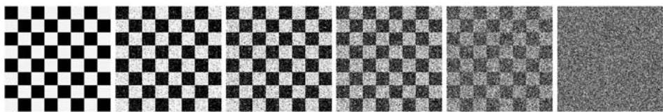

AUSTRALASIAN JOURNAL OF PHILOSOPHY

Figure 1: six images with increasing noise levels. The uncompressed file size for every image is 65 KB, while the compressed sizes are as follows (from left to right): 1 KB, 19 KB, 30 KB, 46 KB, 58 KB, and 65 KB.

Dennett's second key insight is that patterns in data are objective. Whether a compressed file is smaller than an uncompressed file is simply a matter of counting bits. To put the point in terms of algorithmic information theory, it is trivial to determine whether one program (represented as a string of ones and zeros) is shorter than another. $^3$ As Dennett argues, 'A pattern exists in some data—is real—if there is a description of the data that is more efficient than the bit map, whether or not anyone can concoct it' [ibid.: 34]. In the real world, these data may describe anything from baseball statistics to astronomical measurements. What is essential is that we have some raw data that we can recover from a more economical description. The fidelity and economy of this description tells us to what extent a pattern is present in the data, while the details of that description tell us the nature of the pattern itself.

This seems like an appropriate way to think about patterns in static data, but it remains unclear what compression has to say about predictive models of physical systems whose state evolves over time. I will say more about this in a subsequent section, but for now I will focus on Dennett's approach. Essentially, a model of a physical system (like a human brain) can be cast at different levels of abstraction. To describe the operation of the brain (and hence to account for its behaviour) at the microphysical level would require a vastly complicated model. Fortunately, we can also adopt a simpler, high-level model—for example, one that posits a belief-desire psychology. Such models have remarkable accuracy, given their simplicity relative to low-level models. Dennett argues that this economy, consistently with compression in general, depends on regularities in human behaviour and, indirectly, on the cognitive processes that generate it. $^4$

Under this compressibility criterion, models are favoured to the extent that they accurately and economically represent the relationships between variables of interest. These variables, Dennett argues, are fixed via an 'interpretation scheme' that identifies such variables for subsequent modelling [ibid.: 41]. For example, Dennett considers an intentional systems model of a chess-playing computer. In this case, the interpretation scheme relies on an 'ontology of chess-board positions, possible chess moves, and the grounds for evaluating them' [ibid.]. Once this interpretation is fixed, argues Dennett, we can develop a simple and predictive model of the computer that looks at the state of the board, posits intentional states (including beliefs about the state of the board, instrumentally useful moves, or what its opponent might do), and predicts chess